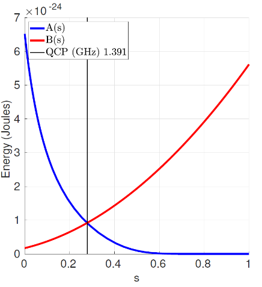
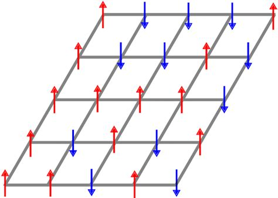

# Adiabatic Theorem {.unnumbered}

Adiabatic Quantum Computing (AQC) is a model of computation that uses quantum-mechanical processes operating under adiabatic conditions. It is the main mechanism quantum computers use to obtain the minimum energy or ground state for a given problem, and it is the main approach we use to solve hard combinatorial optimization problems [@Albash_2018].

This type of quantum computing is based on continuous-time evolution of a quantum state $|\psi(t)\rangle$ from a well-defined initial value to compute a final observed value. The evolution is modeled by the time-dependent [Schrödinger equation](https://en.wikipedia.org/wiki/Schr%C3%B6dinger_equation)

$$
i\hbar \frac{\partial|\psi(t)\rangle}{\partial t}= H(t)|\psi(t)\rangle
$$

operating in the presence of adiabatic changes to the governing Hamiltonian $H(t)$ over the range $t\in\left[0,T\right]$, where $\hbar$ is Planck’s constant. Adiabatic computing is computationally equivalent to all other quantum computing models, including the circuit and topological models, and it can efficiently solve any problem in BQP [@aharonov2008adiabatic]. However, it was originally proposed as a method for solving satisfiability problems [@farhi2000numerical] and it has received attention for the simplicity by which combinatorial optimization problems can be cast in Hamiltonian forms [@lucas2014ising].

The time dependent Hamiltonian for this type of computation is given by the following formula

$$
H(t) = A(t)H_{A} + B(t)H_B
$$

where $t\in[0, T]$ for the total time evolution $T$. The temporal schedules ($A(t)$ and $B(t)$) control the level of interpolation between the initial and final Hamiltonian ($H_A$ and $H_B$). These Hamiltonians have some special characteristics:

* $H_A$ is known, by known it also means we know its ground state and that we will be able to make it so that $|\psi(t_0)\rangle$ matches that state.
* $H_B$ is our target Hamiltonian. A mapping that represents our combinatorial optimization problem. We would like to obtain its ground state.

By making the schedule functions meet the conditions $A(t_0) = 1$, $B(t_0)  =0$, $A(T) = 0$ and $B(T) = 1$ we are able to produce an interpolated mixture of both Hamiltonians so that if the evolution is slow enough and the gap between ground state and other existed states remains the state produced at the end of the evolution should match the ground state of our final Hamiltonian ($H(T) = H_B$).

<figure markdown>

</figure>

A critical issue when performing this type of computation and selecting the right scheduling function is that the minimum spectral gap, energy spectrum gap between ground state and remaining excited states, is kept non-zero during the whole transition. Otherwise, no guarantee of obtaining the target state can exist. In particular, we should care about the gap expressed as

$$
g_{min} = \min_{0\le t \le T} \min_{j\ne0} |E_j(t) - E_0(t)|
$$

Visually, you can see the issues.
<figure markdown>

</figure>

It might be risky if at those points the evolution moves _too fast_. Therefore, we should select a scheduling function that apart from initial conditions also takes into consideration the compensation of the gap evolution to minimize transitions to higher energy states. Therefore, ending on local optima instead of maintaining in the global minima.

<figure markdown>

</figure>

As long as this evolution is above zero, we should be quite confident of the result at the end of the process ($T$).

A common form for the initial Hamiltonian is $H_A = -\sum_i^n \sigma_{x_i}$ being $\sigma_x$ the Pauli operator (previously mentioned $X$ operator) applied to each $i$ index qubit. This hamiltonian is chosen given that we do know its ground state $|+\rangle^n$ and how to prepare it in our systems (remember the Hadamard gate). One common target Hamiltonian form we can find in the literature is defined as the **Ising model**. It uses variables $s_i = \pm 1$ to characterize the magnetic dipole moment in order to characterize ferromagnetism. Its mathematical form is of the shape

$$
H = -\sum_{\langle i j \rangle} J s_i s_j - \sum_j h s_j
$$

where $h$ characterizes the spin energy as well as their _position preference_ (spin up or down) and $J$ is the coupling strength between neighboring spins. It is a general form that might be used to characterize the contribution of individual and collective variables involved in a given process. The appropriate selection of $s_i \in S$ should render the option that minimizes/maximizes the energy of our Hamiltonian.

<figure markdown>

</figure>

It is the general case and many providers will likely have some decision already made for us (scheduling functions and initial Hamiltonian for example) but there are other cases where initial state and hamiltonian can be wisely selected so that the starting point is already close to the target state we would like to obtain. This example is quite common in cases like chemistry where HartreeFock states could be a better initialization or some relaxed version of the target problem could also be solved (classically) and its solution used to approximate the global optima (warm-starting).
