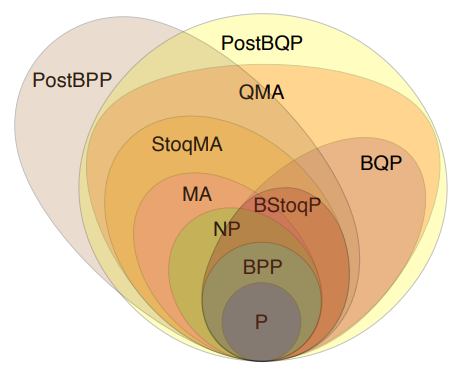

We do have a mathematical formalism to perform computation and devices capable of processing these instructions for us. Now we only need a set of relevant hard to solve problems that could benefit from those resources.

A relevant aspect of quantum computing is that given the low level at which we will work, the words **circuit** and **algorithm** interchange. Classical computing algorithms are way more abstract nowadays than in the original days, closer to the actual electronics. This is where quantum computing still may confuse you as the steps of an algorithms are represented in blocks of logical gates composing a circuit.

## Types of algorithms {.unnumbered}

In general by the term algorithm we refer to a set of operations that transform our initial quantum state into a final state. In this regard many types of algorithms can be found.

**Communication**

_Quantum Key Distribution_ (QKD), _Superdense Coding_ and _Quantum Teleportation_ are protocols involving quantum resources that help us communicate better, safer or faster.

<figure markdown>
{width=60%}
</figure>

**Building blocks**

Certain circuits/algorithms are also building blocks of more complex algorithms. For example, _Quantum Fourier Transform_ (QFT) is used to map a given input to a phase change on the $Z$ axis.

Its inverse, makes the opposite, any operation that only rotates the status of a qubit on $Z$ axis will render a superposition state when measured. Therefore, iQFT transforms this amplitude into a final state triggering the phase change of a given quantum state.

<figure markdown>
{width=60%}
</figure>

These are fundamental blocks for basic algorithms such as _Quantum Phase Estimation_ which takes part in the famous factoring algorithm by Shor.



**Canonical examples**

There are some algorithms every quantum computing specialist should be familiar with.

* [Grover's algorithms](https://learning.quantum.ibm.com/course/fundamentals-of-quantum-algorithms/grovers-algorithm)
* [HHL algorithm](https://github.com/Qiskit/textbook/blob/main/notebooks/ch-applications/hhl_tutorial.ipynb)
* [Shor's algorithm](https://en.wikipedia.org/wiki/Shor's_algorithm)
* [Quantum walk search](https://en.wikipedia.org/wiki/Quantum_walk_search)

Most of them are hard to realize due to the ancillary qubits required for the implementation. Other than basic examples, as soon as the problem grows in size it becomes challenging to implement those even using local simulators.

Our main focus for this following section will be dedicated to **combinatorial optimization**. In this regime some specific quantum computing forms will be visited and how existing services can be used to actually implement those algorithms for specific purposes.

## Computational complexity

If one looks at the media it looks that _ENTER THE NEW TREND HERE_ will be much better than what whatever we might be using. This is something Quantum Computing has also been affected by. Thus, it is important to frame the potential gain QC may introduce to our processes as depending on the complexity of it could well be there is no justification to adopt a new paradigm given the effort it requires.

BQP (bounded error, quantum, polynomial time) is a superset of polynomial complexity class within NP (nondeterministic polynomial) problem space.

<figure markdown>

</figure>

So, let's be aware that some problems can as well be efficiently solved by existing classical resources. Others, might be not even suitable for quantum computers being too hard to solve as well. So there is a sweet-spot where a set of problems may benefit from being solved using QC. Let's not assume superiority by default.

We will start with a critical process for many companies and part of the key processes when it comes to Machine Learning.
