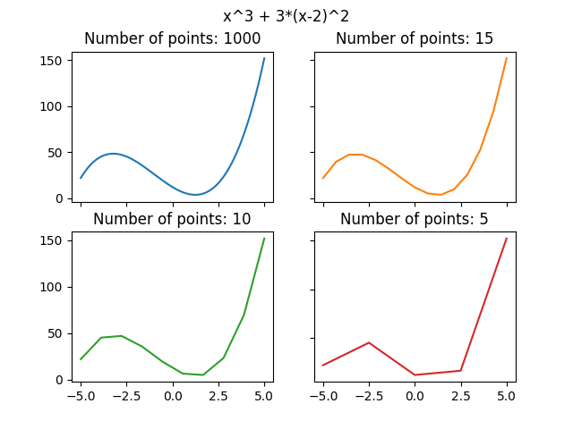
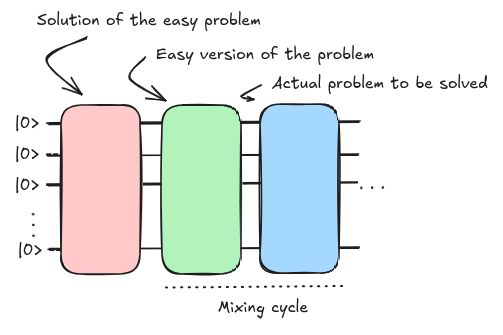
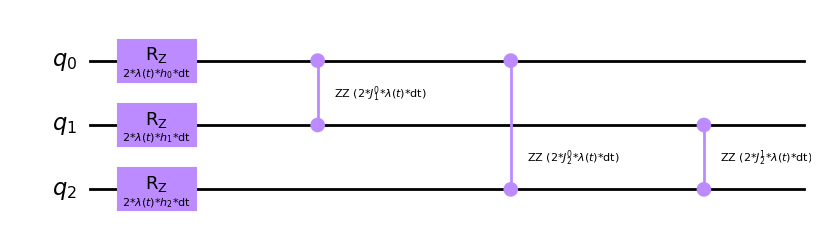
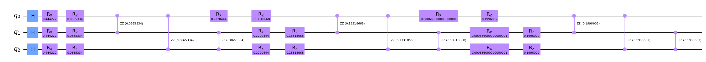

# Introduction to digitization {.unnumbered}

Digitized quantum computers work indeed in a different manner. Hamiltonians are _less_ important from a program perspective. All we need is the set of instructions to be provided for them to run. Of course, these instructions cannot come out of the blue, so we still apply previous principles but with the flexibility of being able to tweak how the initial quantum state evolves. We are not limited by a given algorithm or device configuration, as there exist no default setup other than the initial state of the system ($|0\rangle^n$). It is up to our design how it will work and how much juice we squeeze out of the machine.

As an example, we can still benefit from the AQC paradigm and implement a time dependent Hamiltonian that solves our problem like before. One critical aspect though is the fact that digitized quantum computers work in cycles and actions will need to be discretized (bounded in time) in order to implement our wanted state evolution. But it gives us more room to change some of the parameters machines like D-Wave's ones have fixed for us. That way, we may more options to explore.

## Trotter-Suzuki decomposition

Approximating a time-dependent Hamiltonian can be challenging as working with continuous values on a cycle driven machine (digital machine) requires us to discretize the time evolution into piecewise linear steps.

<figure markdown>

</figure>

If we consider out unitary evolution for the Hamiltonian $U(T,t_0)$ we could take same approach and approximate its results by extending its definition to discrete intervals.

$$
U(T,t_0) = U(t_n, t_{n-1})U(t_{n-1}, t_{n-2}) \dots U(t_1, t_0)
$$

The smaller the step the better we will approximate ideal continuous case. Take also into consideration that $\delta t_i = t_{i+1} - t_i$ do not have to be equally spaced for all $i$s even though it does help for generalization purposes.

In quantum mechanics there exists a concreta example of this effect called the Suzuki-Trotter expansion or Trotterization [2]. If the Hamiltonian has the shape $e^{A+B}$ its limit can be defined

$$
e^{A+B} = \lim_{n\rightarrow\inf} \left( e^{\frac{A}{n}}e^{\frac{B}{n}}\right)^n
$$

Meaning we can alternate the effect of a decomposed Hamiltonian ($H = H_A + H_B$) divided by a discrete number of steps so that the smaller the step size the better we will approximate the ideal case of a constant time evolution.

## A practical example

Let's go step by step. Our digitized annealing algorithm will be composed by three main blocks as we already explained before.

<figure markdown>

</figure>

The mixing cycle is where the mixture between our initial Hamiltonian and problem Hamiltonian happen according to the scheduling function.

[Some support material](https://arxiv.org/abs/1906.08948)

One critical aspect is to be able to initialize the system to the ground state of our initial Hamiltonian ($|+\rangle$ from our previous example). This can be easily achieved by Hadamard operations placed on each qubit.

```py
from qiskit import QuantumCircuit

init_state = QuantumCircuit(3)
for qi in init_state.qubits:
    init_state.h(qi)

init_state.draw('mpl')
```

<figure markdown>

</figure>

Then, we need to produce the combination of our two hamiltonians. We will continue with previously seen examples. First the initial hamiltonian:

$$
H_A = -\sum_i^n \sigma_{x_i}
$$

In this case its effect is conditioned by the scheduling function. Let's rewrite the previous time dependent Hamiltonian such that a single scheduling function defines the mixture.

$$
H(t) = (1-\lambda (t))\left( -\sum_i^n \sigma_{x_i} \right) + \lambda (t) H_p
$$

That way we could introduce a parameterized quantum circuit in which a progressively decaying parameter $\theta$ would match the effect of $1-\lambda (t)$.

```py
from qiskit import QuantumCircuit
from qiskit.circuit import Parameter

lt = Parameter("$(1-\\lambda (t))$")
dt = Parameter("dt")

Ha = QuantumCircuit(3)

for qi in Ha.qubits:
    Ha.rx(2*dt*lt, qi)

Ha.draw('mpl')
```

<figure markdown>

</figure>

And for our target Hamiltonian, if we select previous Ising type of Hamiltonian, we may only need to introduce the parameters affecting our specific instance of the problem.

```py
from qiskit import QuantumCircuit
from qiskit.circuit import Parameter

lt = Parameter("$\\lambda (t)$")
dt = Parameter("dt")

h = []
for i in range(3):
    h.append(Parameter(f"$h_{i}$"))

J = {}
for i in range(3):
    for j in range(i+1, 3):
        J[(i,j)] = Parameter(f"$J_{j}^{i}$")

Hp = QuantumCircuit(3)

for i in range(3):
    Hp.rz(2*dt*lt*h[i], i)

for i in range(3):
    for j in range(i+1, 3):
        Hp.rzz(2*dt*lt*J[(i, j)], i, j)

Hp.draw('mpl')
```
<figure markdown>

</figure>

With these three pieces we can build our digitized version for an adiabatic computation. Just by selecting the resolution of the $\lambda (t)$ function (often called the number of trotter steps) we can build the whole end to end circuit.

```py
from qiskit import QuantumCircuit

qc = QuantumCircuit(3)

# Init state
qc = qc.compose(init_state)

# Trotter steps
for dtval in [0.333, 0.6666, 0.999]:
    qc = qc.compose(Ha.bind_parameters({dt: 0.333, ltA: (1-dtval)}))

    params = {dt: 0.333, ltB: dtval}
    for i in range(3):
        params[h[i]] = 0.3
        for j in range(i+1, 3):
            params[J[(i,j)]] = 0.3
    qc = qc.compose(Hp.bind_parameters(params))

qc.draw('mpl', fold = 150)
```

<figure markdown>

</figure>

We have built our digitized version of the _Adiabatic Quantum Computing_ paradigm. Now, we can tweak it as we want, looking into optimal parameter sets. Change the scheduling function or any other option so that we can implement it on a gate-based quantum computer to check if this outperforms our colleagues from D-Wave. The goal still remains to obtain the ground-state or minimum energy state for the problem Hamiltonian after the whole protocol is performed.

<!-- https://arxiv.org/pdf/2109.10145 -->