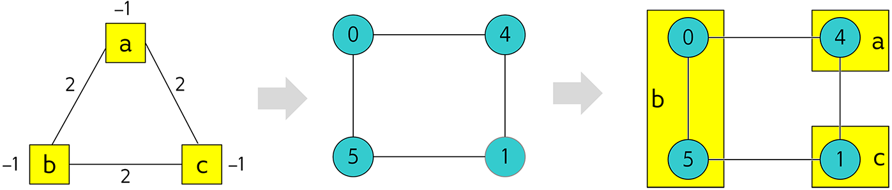

# Problem posing {.unnumbered}

Let's explore a bit how D-Wave provides this service at scale. D-Wave's technology is based on superconducting qubits, so they must keep their machines at 12mk temperature regime in order to maintain the _quantumness_ of the system. Their machines are governed by an already fixed Hamiltonian that looks like:

$$
H_{dwave} = -\frac{A(s)}{2}\left( \sum_i \sigma_x^i \right) + \frac{B(s)}{2}\left( \sum_i h_i \sigma_z^i + \sum_{i>j} J_{ij} \sigma_z^i \sigma_z^j \right)
$$

where $\sigma_{x,z}^i$ are the Pauli matrices operating on qubit $i$ and $h$ and $J$ are problem related variables. So as you can see most of the selection has already been done. We won't enter into more details for the moment but for those interested in how this is done more in detail do not hesitate goring through the [additional information](https://docs.dwavesys.com/docs/latest/c_qpu_annealing.html).

But how do you transform any classical combinatorial problem into a Hamiltonian that fits into this form? This is what we are going to focus on for the next section.

## QUBO and Ising models

We already discussed the Ising model and its potential limitations in terms of only managing quadratic relationships between variables. This is also limited by the hardware, so we will need to understand the way in which our classically formulated optimization problem may fit into this somehow _fixed_ formulations.

Let's start with a simple example of the following form:

$$
\max_x \sum_i a_i x_i \quad
s.t. \quad \sum_i b_i x_i = c
$$

where $a_i$ and $b_i$ are free variables and $c$ is a hard constraint. $x_i \in \{0, 1\}$ will be a mask over the selection on which variables should be selected to maximize our objective function. Why **binary** variables, well, in the end we can only obtain bit strings when reading our quantum states, so it seems sensible to make those the target variables of our problem.

Immediately comes up is the management of restrictions as we will only be able to evaluate the energy level of the system so every bit of information will need to be handled within the objective function itself. That requires us to introduce constraints as regularization terms affecting the objective function in case of not being satisfied

$$
\sum_i b_i x_i = c \quad \rightarrow \quad \left( \sum_i x_i b_i - c\right)^2,
$$

being the power needed to value any deviation (negative or positive) from our target value $c$. These terms need to be conditioned by weight operators so that the problem is regularized, balancing between cost and regularization terms as follows

$$
\max_x \theta_1 \left( \sum_i a_i x_i \right) - \theta_2 \left( \sum_i x_i b_i - c\right)^2.
$$

Therefore, **unconstrained**.

Additionally, our solvers will only be able to minimize the energy of the Hamiltonian so we should pose it as a minimization problem.

$$
\min_x \theta_2 \left( \sum_i x_i b_i - c\right)^2 - \theta_1 \left( \sum_i a_i x_i \right)
$$

With this it should be easy to see hot we can convert this problem into its **Quadratic Unconstrained Binary Optimization (QUBO)** form

$$
\min_x x^TQx + k.
$$

Here $Q$ represents the value matrix between each pair of variables (with the notion of $x_i^2 = x_i$) and the offset constant $k$ (which will be added to the final result but does not affect the optimality search). 

One interesting fact about this formulation is that it contains linear relations ($Q_{ii}x_i$) and quadratic for off diagonal terms ($Q_{ij}x_ix_j \text{ for } i\ne j$).We could pose it on its scalar form as well

$$
\min_x \sum_i a_i x_i + \sum_i \sum_{j\ne i} b_{ij} x_i x_j + k
$$

which can be directly related to previously seen Ising type of Hamiltonian by the transformation $x_i \in \{0,1\}$ to $s_i = \pm 1$.

One clear limitation from the Ising formulation (or the native Hamiltonian of the target device) is the limitation for quadratic terms ($x_ix_j$) so no high-order relationship between variables can be implemented as a general norm. Also, binary characterization is needed, no continuous variable can be introduced within the problem as it is. Of course, there are ways to tackle problems that may require this modifications but it may need an extra effort when mapping our non-QUBO problem to the device.

D-Wave already envisioned a way to ease this tasks, so it provides libraries and functionalities that should help with part of the work to be done. Particularly, transforming from one shape to another and submitting problems to their devices (or trying to solve them locally).

```py
from pyqubo import Spin

s1, s2, s3, s4 = Spin("s1"), Spin("s2"), Spin("s3"), Spin("s4")

# Hamiltonian
H = (4*s1 + 2*s2 + 7*s3 + s4)**2

# model creation
model = H.compile()

# QUBO request (to_ising() exists as well )
qubo, offset = model.to_qubo()
pprint(qubo)

{('s1', 's1'): -160.0,
('s1', 's2'): 64.0,
('s1', 's3'): 224.0,
('s1', 's4'): 32.0,
('s2', 's2'): -96.0,
('s2', 's3'): 112.0,
('s2', 's4'): 16.0,
('s3', 's3'): -196.0,
('s3', 's4'): 56.0,
('s4', 's4'): -52.0}

```
[PyQUBO documentation](https://pyqubo.readthedocs.io/en/latest/)

```py
import dimod
dimod.qubo_to_ising({('x1', 'x1'): -22, ('x2', 'x2'): -6, ('x3', 'x3'): -14,
                     ('x1', 'x2'): 20, ('x1', 'x3'): 28},
                     offset=9)

({'x1': 1.0, 'x2': 2.0, 'x3': 0.0}, {('x1', 'x2'): 5.0, ('x1', 'x3'): 7.0}, 0.0)

```

[dimod documentation](https://docs.ocean.dwavesys.com/en/stable/docs_dimod/)

Being the first always give some advantage, so may of the companies that came after DWave have adopted this libraries and offer certain interoperability. You may find some examples in [B Hybrid Solvers](../../hybridsolvers.qmd)

## Mapping the problem

Ideally, after this initial conversion has been done, the only piece missing is the submission of our job to one of those solvers enabled by our preferred quantum annealing service provider. But hardware might require additional tweaks.

We will need to get a little bit used to the transformation between different formulations for a given problem.
<figure markdown>

</figure>

But more importantly, as those may represent any $i$ $j$ indexes to be connected, the hardware may not present all required connections, in particular in all-to-all cases. Trapped ions make it easy but the rest, require tweaking.

**Embedding**

Looking at the connectivity of the chip, if an index represents a red ball and each line gets tuned by the values in our problem $q_{ij}$, how can we tune those that have no red line between them?

<figure markdown>
{width=60%}
</figure>

[QPU Architecture](https://docs.dwavesys.com/docs/latest/c_gs_4.html#getting-started-topologies)

We might need to find ways to connect qubits that are not directly connected and in D-Wave services we can chain connected qubits so that we could place the potential value of a distant qubit in linked different locations of a chip. This is done by artificially introducing additional variables that are mapped to qubits whose value should align to the qubit they are chained to. A visual representation of this would look like

<figure markdown>
{width=80%}
</figure>

That way if we look to solve our three variable problem into a 4 qubit chip, we might see more than three qubit related readout being reported.

<figure markdown>

</figure>

In above example, 0 and 5 qubits are linked to the same problem variable so they should report same bit readout but qubit _chains_ can break and therefore we will need to play with the chain strength to avoid any invalid solution.

Sadly for us, the embedding of densely connected problems comes with the overhead of chaining a lot of physical qubits so we can make all those all-to-all connections that are not native to the device. In fact, we can check that the encoding they have made (by they we mean the people from D-Wave) we can see the maximum number of qubits of the problems encoded in hardware is in the order of 60 to 100. But is this using thousands of qubits? Yes, this is how bad the overhead can get [@cai2014practicalheuristicfindinggraph].
