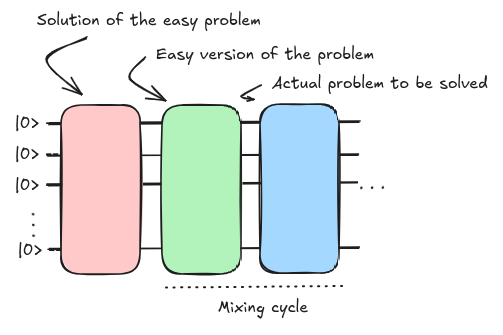
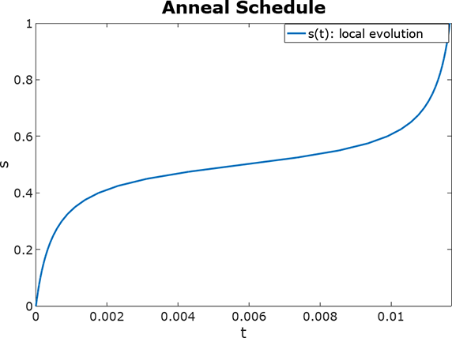
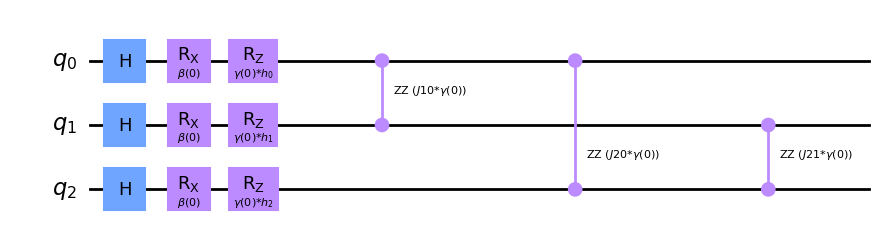

# Quantum Approximate Optimization Algorithm {.unnumbered}

Quantum Approximate Optimization Algorithm (QAOA) inherits its structure from the concept of [Adiabatic Quantum Computing](./adiabatic.md) simply digitizing the steps required to drive the initial state into the solution of the problem to be solved [@farhi2014quantum]. It also can be seen as a particular case of VQE where the ansatz is already defined by the quantum annealing scheme. If we carefully analyze the composition of the annealing algorithm we can identify three main blocks that essentially compose the QAOA circuit.

<figure markdown>

</figure>

The initial and final Hamiltonian blocks ($H_i$ and $H_f$) are the ones that get propagated according to the trotterization, the digitization of the mixing cycle. The challenge was defining the best possible scheduling function so that the evolution is absent of any transition of the ground state. 

Considering some of the previous concepts, we could free-up the scheduling function and come up with a better selection of parameters that minimizes the length of this evolution. If we take a large $n$ in our Suzuki-Trotter approximation we could move beyond the coherent threshold of a machine and setting static time-lapses for the whole evolution might not be the best approach to approximate the target evolution (which we do not fully know). One crucial point researchers focus on is generating the shallowest version of this evolution as the shorter it gets less error gets accumulated (see [Noise and errors](../computers/challenges.md#noise-and-errors)). We refer as the **depth** of the circuit to the maximal length it reaches considering every set of gates that can be executed within the same execution cycle as the unit depth.

If we could enter some placeholders and check how the circuit behaves for a different set of parameters we could maybe find a better solution than the canonical set of equally spaced steps that places the evolution at critical points of our scheduling curve.



So, by putting some parameters to the mixing blocks we get

$$
|\gamma, \beta\rangle = U(H_B,\beta_p)U(H_C, \gamma_p) \dots U(H_B,\beta_1)U(H_C, \gamma_1)|s\rangle
$$

where $|s\rangle$ is our starting state and $U(H_m, \theta_m) = e^{-i\theta_mH_m}$ is the unitary transformation parameterized for each step for a total of $p$ steps.

We could setup a free-form circuit so that we could change the values for those rotation angles according to a different criteria than the one used before.

```py
from qiskit import QuantumCircuit

init_state = QuantumCircuit(3)
for qi in init_state.qubits:
    init_state.h(qi)

# Initialization
layers = 1
qc = QuantumCircuit(3)

# Init state
qc = qc.compose(init_state)

# Trotter steps
for layer_idx in range(layers):
    # Init hamiltonian
    qc = qc.compose(Hi(layer_idx))

    # Final hamiltonian
    qc = qc.compose(Hf(layer_idx))

qc.draw('mpl', fold = 150)
```
<figure markdown>

</figure>

This is the basis of the Quantum Approximate Optimization Algorithm (QAOA). We only require to select the number of steps (also called layers when) in order to produce our template circuit. Then it comes the time to select the values that should replace placeholder parameters $\gamma$ and $\beta$.

The selection of both Hamiltonians, as if we did not have a _good_ initial Hamiltonian, our selection of parameters could make as fall into a higher energy level eigenstate ($|\lambda_1\rangle$) and by continuously applying our unitary associated to the target Hamiltonian we would get stuck in the same quantum state forever ($U|\psi_{\lambda_1}\rangle = E_{\lambda_1}|\psi_{\lambda_1}\rangle$). That is how our initial Hamiltonian throughout the whole evolution allows us to scape those local minima looking for the actual ground truth.