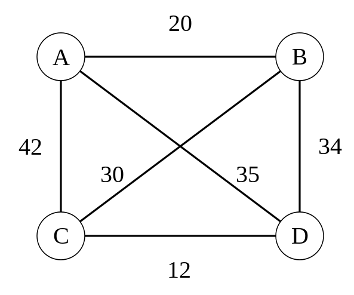

# QUBO formulation {.unnumbered}


As we saw during class, one important part of being able to use those quantum computing devices is posing our problem as a matrix representation following the QUBO formulation. We could then convert it to Ising type if needed but we will see some of the most common frameworks already provide a translation mechanism between the two.

Therefore a critical aspect of it will be knowing how to transform our penalty terms so that they fit into the objective function to be minimized.

Known penalties

| Classical Constraint | Equivalent Penalty |
|----------------------|--------------------| 
| $x + y \le 1$ | $P(xy)$ |
| $x + y \ge 1$ | $P(1− x − y + xy)$ |
| $x + y = 1$ | $P(1− x − y + 2xy)$ |
| $x \le y$ | $P(x − xy)$ |
| $x_1 + x_2 + x_3  \le 1$ | $P(x_1 x_2 + x_1 x_3 + x_2 x_3)$ |
| $x = y$ | $P(x+y- 2xy)$ |

with $P$ being a positive scalar characterizing the effect of the penalty over the cost function. It is [a topic on its own](https://docs.dwavequantum.com/en/latest/quantum_research/reformulating.html#constraints-conflict-graph-technique).

We will see how some classical problems can be mapped to their QUBO form so that these problems can be solved by Quantum Algorithms.

## Binary Linear Programming

Taken from [@lucas2014ising], Binary Linear Programming problem tries to solve a problem of the shape $Sx = b$ where $x$ is the unknown vector of binary variables to be solved. It is a simple example as it already provides the shape we need with variables being binary, no higher order relation exists and has no constraints to care about. In order to solve this problem we will need to reformulate our previous form into:

$$
\arg \min_{x} \| Sx - b \|
$$

$$
H_A = \sum_{j=1}^m \left[b_j - \sum_{i=1}^N S_{ji}x_i \right]^2
$$

aiming to obtain our solution for $x$ when $H_A = 0$ so the minimization is done over $H_A$ like follows

$$
\min_x \sum_{j=1}^m \left[b_j - \sum_{i=1}^N S_{ji}x_i \right]^2
$$

Let's select a particular instance for $S$ and $b$.

```{python}
import numpy as np

S = np.array([
    [3, 4, 1, 1, 2],
    [1, 9, 2, 2, 1],
    [6, 8, 2, 2, 1]
])
b = np.array([10, 13, 17])
```

So, now we can start composing our $Q$ matrix.

```{python}
import itertools

n = S.shape[1]
m = b.shape[0]

Q = np.zeros((n, n))

for j in range(m):
    # Diagonal terms
    for i in range(n):
        Q[i][i] -= 2 * b[j] * S[j][i]

    tuples = itertools.product(range(n), repeat=2)
    for tuple_ in tuples:
        x = tuple_[0]
        y = tuple_[1]
        # Divided as we are adding same value to ij and ji
        Q[x][y] += S[j][x] * S[j][y] / 2.
        Q[y][x] += S[j][x] * S[j][y] / 2.

Q
```

As you can see the matrix is symmetric as there is a natural symmetry between $x_ix_j$ and $x_jx_i$. We could brute force our solution.

```{python}
min_val = 0
min_sol = []

for x in np.c_[tuple(i.ravel() for i in np.mgrid[:2, :2, :2, :2, :2])]:  # noqa
    if x @ Q @ x.T < 0:
        if (x @ Q @ x.T) < min_val:
            min_val = x @ Q @ x.T
            min_sol = x

print(min_sol, "|", min_val)
```

So our solution should be [1 1 0 1 1], let's check.

```{python}
np.matmul(S, [1, 1, 0, 1, 1])
```

```{python}
b
```

There you go, it is the actual solution.

## MaxCut

Maximum cut is another canonical example often used to characterize the flow between the nodes of a network mapping a distribution network, electricity or telecommunication networks or even circuit design. The main idea comes from splitting the vertices of a graph into two complementary sets such that the number of edges is maximally cut.

::: {.callout-note}
_NetworkX package will need to be added to your Python environment for this example_
:::

```{python}
import networkx as nx
from networkx.generators.random_graphs import gnm_random_graph

def gen_graph(size, seed=None):
    if seed is not None:
        return gnm_random_graph(size, size, seed=seed)
    return gnm_random_graph(size, size)
```

```{python}
G = gen_graph(5, None)
nx.draw(G)
```

We can model this problem by identifying each node $j$ in one or other set of the two possible options ($x_j = 0$ or $x_j = 1$). With that we can set the formula $x_i + x_j - 2x_ix_j$ so that it identifies whether edge $(ij)$ is in the cut (if only one $x$ is active then it will equal 1).

That leaves us with the general formula

$$
\max \sum_{(i,j)} (x_i + x_j - 2x_ix_j)
$$

which we can convert to a minimization problem by changing the sign.

```{python}
n = G.order()
nodes = list(G.nodes)

Q = np.zeros((n, n), dtype=np.dtype(np.int32))
for edge in G.edges:
    idx1 = nodes.index(edge[0])
    idx2 = nodes.index(edge[1])
    Q[idx1][idx1] += 1
    Q[idx2][idx2] += 1
    
    # Half the value as it is introduced twice
    Q[idx1][idx2] -= 1
    Q[idx2][idx1] -= 1

Q = -1.0*Q # Min
```

```{python}
Q
```

```{python}
min_val = 0
min_sol = []

for x in np.c_[tuple(i.ravel() for i in np.mgrid[:2, :2, :2, :2, :2])]:  # noqa
    if x @ Q @ x.T < 0:
        if (x @ Q @ x.T) < min_val:
            min_val = x @ Q @ x.T
            min_sol = x

print(min_sol, "|", min_val)
```

This case is a little bit more complicated as more than one option can be selected. Ideally we would like to obtain all potential solutions.

```{python}
solution = np.array(min_sol)
red_team = np.where(solution == 1) 
blue_team = np.where(solution == 0) 
```

```{python}
pos = nx.spring_layout(G)  # positions for all nodes

# nodes
options = {"edgecolors": "tab:gray", "node_size": 800, "alpha": 0.9}
nx.draw_networkx_nodes(G, pos, nodelist=red_team[0], node_color="tab:red", **options)
nx.draw_networkx_nodes(G, pos, nodelist=blue_team[0], node_color="tab:blue", **options)

nx.draw_networkx_edges(G, pos, width=1.0, alpha=0.5);
```

## Knapsack problem (quadratic)

Fitting a set of assets according to the size of the bag we want to use can be a hard combinatorial problem. Not that we are going to do the full fledged example but it is interesting to look at it from an implementation perspective.

Quadratic Knapsack corresponds to the problem where interaction exists between the variables we would like to model:

$$
max \sum_{i=1}^{n-1} \sum_{j=i}^n w_{ij}x_i x_j
$$

considering there is a budget constraint so that

$$
\sum_{j=1}^n a_j x_j \le b.
$$

Variables $x_i$ represent the mask of selecting or not $i$ element to be considered. $w_{ij}$ sets the value of taking in two elements at the same time, $a_j$ represents the weight associated to $j$ and $b$ sets the available budget for the whole thing (the size of our Knapsack indeed). As can be seen many different types of problems can be mapped to this canonical example.

One relevant aspect of inequalities is that we will need to add slack variables to turn the constraint into the equality $\sum_j a_j x_j + S = b$. Here $S$ ranges from 0 to $b$, so its binary encoding must be able to represent every value in that range while keeping the problem quadratic.

We can start by adding the restriction to the objective function followed by a penalty term.

$$
max \sum_{i=1}^{n-1} \sum_{j=i}^n w_{ij}x_i x_j - P\left(\sum_{j=1}^n a_j x_j + S - b\right)^2
$$

::: {.callout-note}
Test case from [Quantum Bridge Analytics I](https://arxiv.org/pdf/1811.11538.pdf)
:::

```{python}
weight = np.array([
            [2, 4, 3, 5],
            [4, 5, 1, 3],
            [3, 1, 2, 2],
            [5, 3, 2, 4]
        ])
costs = [8, 6, 5, 3]
budget = 16
```

For this case, slack variables with weights $1, 2, 4, 8,$ and $16$ can represent every possible value of $S$ from 0 to the budget.

$$
8x_1 + 6x_2 + 5x_3 + 3x_4 + 1s_0 + 2s_1 = 16
$$

```{python}
costs.extend([1, 2, 4, 8, 16])
costs
```

And penalty, well, we need to decide on a figure.

```{python}
P = 10
```

```{python}
n = len(costs)

Q = np.zeros((n, n))
# First term
for i in range(len(weight)):
    for j in range(i, len(weight)):
        Q[i][j] += weight[i][j]

# Constraint section
for i in range(n):
    for j in range(n):
        Q[i][j] -= P * costs[i] * costs[j]
    Q[i][i] += P * 2 * budget * costs[i]

Q = -1.0*Q # min
```

```{python}
Q
```

```{python}
min_val = 0
min_sol = []

for x in itertools.product([0, 1], repeat=n):
    x = np.array(x)
    if x @ Q @ x.T < 0:
        if (x @ Q @ x.T) < min_val:
            min_val = x @ Q @ x.T
            min_sol = x

print(min_sol, "|", min_val)
```

Play around with the penalty term to check its effect in the final solution. Change costs so we can see the evolution of the solution and slack variables being used.

## Traveling Salesperson Problem

Another example problem that has been covered in the literature [@lucas2014ising] is the Hamiltonian cycles or Paths. It is a problem that tries to identify the optimal route to cover a set of cities given that there is a cost associated to going from point $a$ to point $b$ considering a cycle is obtained and its resolution renders the minimum cost for any other potential cycle.

<center>
    
</center>

```{python}
G = nx.DiGraph()
G.add_weighted_edges_from({
    ("A", "B", 20), ("A", "C", 42), ("A", "D", 35), ("B", "A", 20),
    ("B", "C", 30), ("B", "D", 34), ("C", "A", 42),("C", "B", 30),
    ("C", "D", 12), ("D", "A", 35), ("D", "B", 34), ("D", "C", 12)
})

nx.draw(G)
```

We will try to come up with a simplified version that may not capture the entirety of the cycles but it is easier to understand. Let's start by defining our variables $x_{ij}$ which will take the positive value when the route is connected by node $i$ to $j$.

$$
x_{i \, j} = 
    \begin{cases} 
        1, & \text{$i$ is connected to $j$} \\
        0, & \text{otherwise} 
    \end{cases}
$$

with a distance/cost of $c_{ij}$. The idea is to visit all nodes but without going over the same road in the route more than once (like the Königsberg bridge problem [@mezard2009information]). And ideally doing it at a minimum cost. Therefore,

$$
\min \sum_i^n \sum_{j, j \ne i}^n c_{ij}x_{ij}
$$


But a set of conditions need to be met, in particular there is a temporal axis we will also need to consider so that by starting at a given position each time step requires movements forward. This will add a $t$ for each step of the whole route to our previous variables (cost won't be affected much) so that we can identify the start and ending point ($x_{ijt}$). Therefore, previous case will require a $2^4 \times 2^4$ matrix to characterize the whole set of possible edges (those that exist and those which don't) considering the transitions being made.

$$
\min \sum_p^P\sum_i^N \sum_{j, j \ne i}^N c_{ij}x_{i,p}x_{j,(p+1)}
$$

Constraints to have in mind, the salesperson should use each road only once. That means we should limit $\forall i \in \{0...n\} \sum_i^n x_{ip} = 1$ both row and column-wise, meaning salesperson is in one place at each time $p$ and can only be in one $n$ alone.

$$
H_{penalty} = \lambda\sum_{n=0}^N\left( 1 - \sum_{p=0}^P x_{n,p}\right)^2 + \lambda\sum_{p=0}^P\left( 1 - \sum_{n=0}^N x_{n,p}\right)^2 + \lambda\sum_{(i,j)\notin G}\sum_{p=0}^P x_{i,p}x_{j,p+q}
$$

In our QUBO setup, this constraint needs to be part of the objective function acting as a maximizer in our example. Usually a good estimate for a Lagrange parameter is between 75-150% of the objective function value, so we come up with an estimate for tour length and use that.

```{python}
lagrange = 100
```

Then according to previous indications, our formulation should follow the intuition that:

* If a node has exactly one active position ($k=1$) the penalty is 0 (good choice)
* Otherwise the penalty is positive and grows as $(k-1)^2$.
* We implement the penalty unit block inside $H_{penalty}$: $$\text{Penalty}_n = \lambda\left(\sum_{p=0}^{P-1} x_{n,p} - 1\right)^2$$ indicating that a single occupied variable should happen per node at a high cost ($\lambda$) for its potential positions ($p$ here as a general approach to the time indexed $it$).

If we expand the Penalty term

$$
\text{Penalty}_n = \lambda\left(\sum_p x_{n,p}^2 + 2\sum_{p<q} x_{n,p}x_{n,q} - 2\sum_p x_{n,p} + 1\right)
$$

Since $x^2 = x$ for binary variables this simplifies to:

$$
\text{Penalty}_n = -\lambda\sum_p x_{n,p} + 2\lambda\sum_{p<q} x_{n,p}x_{n,q} + 1
$$

**How does this map to QUBO form**

Considering we will solve this as a minimization problem (minimize the cost of traveling)

- Linear (diagonal) term: `Q[((node, pos), (node, pos))] -= lagrange` implements the $-\lambda \;x_{n,p}$ contribution.
- Pairwise (off-diagonal) term: `Q[((node, pos1), (node, pos2))] += lagrange` adds half of the $2\lambda$ coupling; the symmetric entry provides the other half in the QUBO matrix representation.

This gives us the final shape
$$
\min \; H_{cost} + H_{penalty}
$$

where $H_{cost}$ is the time-indexed travel cost above and $H_{penalty}$ is the sum of the node, position, and forbidden-edge penalties. For the two equality penalties, the expanded form is obtained by applying the same binary-variable identity shown above to each node and each position.

assuming non existent edges are also added at a high cost ($\lambda$).

```{python}
from collections import defaultdict

# Creating the QUBO
Q = defaultdict(float)

# number of steps
N = G.number_of_nodes()

# Objective that minimizes distance
for u in G:
    for v in G:
        if u == v:
            continue
        value = G[u][v]["weight"] if G.has_edge(u, v) else lagrange
        for pos in range(N):
            nextpos = (pos + 1) % N
            Q[((u, pos), (v, nextpos))] += value

# Constraint that each row has exactly one 1
for node in G:
    for pos_1 in range(N):
        Q[((node, pos_1), (node, pos_1))] -= lagrange
        for pos_2 in range(pos_1+1, N): # Next positions
            Q[((node, pos_1), (node, pos_2))] += 2 * lagrange

# Constraint that each col has exactly one 1
for pos in range(N):
    for node_1 in G:
        Q[((node_1, pos), (node_1, pos))] -= lagrange
        node_list = list(G)
        node_index = node_list.index(node_1)
        for node_2 in node_list[node_index + 1:]:
            Q[((node_1, pos), (node_2, pos))] += 2 * lagrange # Cost of being in more than one place
```

The dictionary above stores each unordered pair once, so its coefficient is the full $2\lambda$ coupling from the expanded penalty. If a symmetric matrix representation is used instead, that coupling can be split equally between $Q_{i,j}$ and $Q_{j,i}$.

```{python}
Q
```

These challenges have been also classically solved using simulated annealing procedures.

```{python}
from networkx.algorithms import approximation as approx

cycle = approx.simulated_annealing_tsp(G, "greedy", source="D")
cost = sum(G[n][nbr]["weight"] for n, nbr in nx.utils.pairwise(cycle))
print(f"Cost for route {cycle} is {cost}")
```

And can be also solved by traversing the whole solution space (if possible).

```{python}
import dimod

sampler = dimod.ExactSolver()

response = sampler.sample_qubo(Q)

print(response.slice(0, 15))
```

Several options show up as optimal, which is the case. This is one of those examples where quantum superposition could render a state that reveals all optimal configurations.

```{python}
route = response.first.sample

cycle = [None]*5
for key in route:
    if route[key] == 1:
        cycle[key[1]] = key[0]
cycle[-1] = cycle[0]

cost = sum(G[n][nbr]["weight"] for n, nbr in nx.utils.pairwise(cycle))
print(f"Cost for route {cycle} is {cost}")
```

Using [DWave's package](https://github.com/dwavesystems/dwave-neal) we could also check SA performance.

```{python}
import neal

sampler = neal.SimulatedAnnealingSampler()
response = sampler.sample_qubo(Q)
print(response)
```

```{python}
route = response.first.sample

cycle = [None]*5
for key in route:
    if route[key] == 1:
        cycle[key[1]] = key[0]
cycle[-1] = cycle[0]

cost = sum(G[n][nbr]["weight"] for n, nbr in nx.utils.pairwise(cycle))
print(f"Cost for route {cycle} is {cost}")
```

We will recover this formulation for the comparison example on the different ways of implementing the solution to this challenge. There do exist other approaches based on [dynamic programming](https://arxiv.org/pdf/2502.08853v1) but better stick to the basics for now.