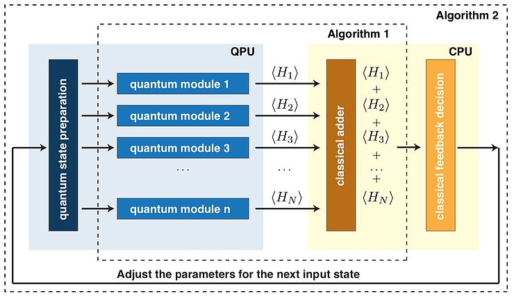

# Variational Quantum Eigensolver {.unnumbered}

VQE does a upper bound approximation to the minimum energy of a given Hamiltonian. The ground state of a Hamiltonian represents the system state rendering the minium energy level (let's call it $E_0$). If we decompose the eigenvalues and eigenvectors to our target Hamiltonian we would obtain the whole energy spectrum and see which is actually the quantum state associate to the minimum energy value.

$$
H|\psi_{\lambda}\rangle = E_{\lambda}|\psi_{\lambda}\rangle
$$

This is useful when, for example, looking to the state that minimizes system energy in chemistry. But of course if our problem is mapped to a Hamiltonian and its minimum energy is the outcome of our cost function minimization, then the obtained quantum state will therefore render as the solution to our problem.

Thus, this way to approximate the minimum energy of the system could be quite useful is it requires less computation than the actual calculation of the eigenstates of our system.

We do know that for a set of parameters on a parameterized ansatz, the outcome will be a target state $|\psi\rangle$ and that we can compute the energy level of a given state as $\langle \psi | H |\psi\rangle = E(\psi)$. If this state is driven by a parameterized quantum circuit then we could modify the parameters looking for different states ($|\phi\rangle$) hopefully in the direction so that $E(\phi) \lt E(\psi)$.

By variationally iterating over potential states we could approximate this state and get our result. Let's do a simple example, let take for example following Hamiltonian

$$
H = \left[
\begin{array}{cc}
3 & 1 \\
1 & -1
\end{array}
\right]
$$

which can be decomposed into a linear combination of Pauli operators $2Z + X + I$. Or a linear decomposition of hamiltonians $H_1 = 2Z$, $H_2 = X$ and $H_3 = I$, hence $H = H_1+H_2+H_3$. We will get back to this. 

VQE only requires an ansatz expressive enough so that target state can be mapped but nothing related to our target Hamiltonian. Therefore, our ansatz could be as simple as a $R_y(\theta)$ rotation.

One thing that should be relevant is the idea of measurement and basis. For $H_2$ we might neet to add additional rotation operations over our initial circuit so that we can properly measure it.

Let's start with $\theta = 0$. Our generated state would be of the shape:

$$
R_y(0)|0\rangle = 
\left[
\begin{array}{cc}
1 & 0 \\
0 & 1
\end{array}
\right]\left[
\begin{array}{c}
1 \\
0
\end{array}
\right] = |0\rangle
$$

Therefore the expectation value for $H_1$ equals:

$$
\langle 0 | H_1 |0\rangle = \left[
\begin{array}{cc}
1 & 0
\end{array}
\right]
\left[
\begin{array}{cc}
2 & 0 \\
0 & -2
\end{array}
\right]\left[
\begin{array}{c}
1 \\
0
\end{array}
\right] = 2
$$

$H_3 = 1$ but evaluating $H_2$ may require a basis change as we would need to measure it corresponding to the $\{|+\rangle, |-\rangle\}$ basis. Therefore, we would need to add a $R_y(-\pi/2)$ to our circuit.

$$
R_y(-\pi/2)|0\rangle = 
\left[
\begin{array}{cc}
0 & 1 \\
-1 & 0
\end{array}
\right]\left[
\begin{array}{c}
1 \\
0
\end{array}
\right] = -|1\rangle = |\psi\rangle
$$

so the expectation value can be computed as

$$
\langle \psi | H_2 | \psi\rangle = \left[
\begin{array}{cc}
0 & 1
\end{array}
\right]
\left[
\begin{array}{cc}
0 & 1 \\
1 & 0
\end{array}
\right]\left[
\begin{array}{c}
0 \\
-1
\end{array}
\right] = 0
$$

Therefore the overall expectation value for $H$ over $|0\rangle$ is 3. We could iterate over all potential values of $\theta$ until we find the actual state that gives us the lowest value but that would also consume quite some time. The important fact here is that, given the basis change we might need to evaluate our ansatz per parameter iteration more than once if the expectation value needs to be obtained at each iteration in order to know the direction in which those parameters should be changed.

**Hybrid workload**

The way to explore the options is by setting a cost function that will help us drive the value into the right direction. Here, expectation value is of great help as we do know it will provide an approximation to the ground state of the system (depending on the amount of time we let it iterate).

This is when traditional or classical optimization routines come handy. We could employ existing methods for classical optimization such as Stochastic Gradient Descent (SDG), Powel's method or Nelder-Mead method looking for efficiently traversing the potential solution space for all values $\theta$ could take.

Also, given previous decomposition we could easily see how this calculations could be performed in parallel maximizing the usage of resources both from the classical and quantum side.

<figure markdown>

</figure>

A key benefit for VQE is that it does not require any specific shape for our ansatz so if a flexible enough option is selected we could benefit those who could better fit into our hardware connectivity topology to obtain the results.
