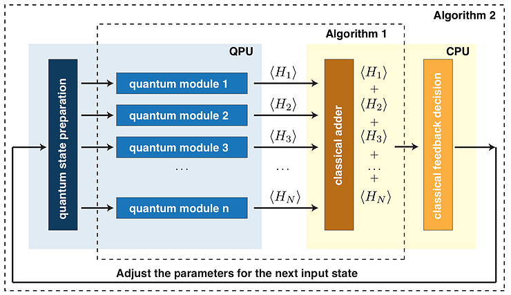

# Variational Quantum Eigensolver {.unnumbered}

Variational Quantum Eigensolver (VQE) [@peruzzo2014variational] is a hybrid quantum-classical algorithm for approximating the lowest eigenvalue of a Hamiltonian. The ground state of a Hamiltonian is the eigenstate $|\psi_0\rangle$ associated with the smallest eigenvalue $E_0$:

$$
H|\psi_{\lambda}\rangle = E_{\lambda}|\psi_{\lambda}\rangle
$$

For any normalized state $|\psi\rangle$, the variational principle gives

$$
\langle \psi | H | \psi \rangle \ge E_0,
$$

with equality only when $|\psi\rangle$ is exactly the ground state. This means that if we parametrize a trial state $|\psi(\theta)\rangle$ and minimize the expectation value

$$
C(\theta) = \langle \psi(\theta) | H | \psi(\theta) \rangle,
$$

we obtain an upper bound on $E_0$. In practice, a classical optimizer updates $\theta$ until this bound is as small as possible. The corresponding state is then the best approximation to the ground state reachable by the chosen ansatz.

This is especially useful when the full diagonalization of $H$ is too expensive, but an approximate ground-state energy is sufficient for the task at hand. That is the case in many chemistry and optimization problems, where the minimum-energy state encodes the desired solution.

To see how this works, consider the following Hamiltonian:

$$
H = \left[
\begin{array}{cc}
3 & 1 \\
1 & -1
\end{array}
\right]
$$

which can be decomposed into a linear combination of Pauli operators as

$$
H = I + X + 2Z.
$$

Using the standard Pauli matrices in the computational basis,

$$
I = \begin{pmatrix} 1 & 0 \\ 0 & 1 \end{pmatrix},
\quad
X = \begin{pmatrix} 0 & 1 \\ 1 & 0 \end{pmatrix},
\quad
Z = \begin{pmatrix} 1 & 0 \\ 0 & -1 \end{pmatrix},
$$

we recover the original matrix form

$$
H = I + X + 2Z =
\begin{pmatrix}
1 & 0 \\ 0 & 1
\end{pmatrix}
+
\begin{pmatrix}
0 & 1 \\ 1 & 0
\end{pmatrix}
+
\begin{pmatrix}
2 & 0 \\ 0 & -2
\end{pmatrix}
=
\begin{pmatrix}
3 & 1 \\ 1 & -1
\end{pmatrix}.
$$

Equivalently, $H = H_1 + H_2 + H_3$ with $H_1 = I$, $H_2 = X$, and $H_3 = 2Z$.

VQE does not require the ansatz to be tailored to the Hamiltonian itself; it only needs to be expressive enough to represent a state close to the ground state. A simple choice is therefore the single-parameter rotation

$$
|\psi(\theta)\rangle = R_y(\theta)|0\rangle = \cos\frac{\theta}{2}|0\rangle + \sin\frac{\theta}{2}|1\rangle.
$$

A practical detail is that different Pauli terms are measured in different bases. For $Z$, the computational basis is already suitable. For $X$, we must rotate the qubit before measuring so that the measurement effectively happens in the $\{|+\rangle,| -\rangle\}$ basis. Concretely, $X = R_y(\pi/2) Z R_y(-\pi/2)$, so measuring $X$ in the computational basis is equivalent to measuring $Z$ after a $R_y(-\pi/2)$ rotation.

With this ansatz, the energy expectation value is

$$
E(\theta) = \langle \psi(\theta) | H | \psi(\theta) \rangle = 1 + \sin\theta + 2\cos\theta.
$$

Indeed, for $|\psi(\theta)\rangle = (\cos\frac{\theta}{2}, \sin\frac{\theta}{2})^T$,

$$
\langle Z \rangle = \cos\theta, \qquad \langle X \rangle = \sin\theta,
$$

so the total energy is the sum of the three Pauli contributions: $1 + 2\langle Z\rangle + \langle X\rangle$.

At $\theta = 0$, the trial state is $|0\rangle$, and therefore

$$
E(0) = \langle 0 | H | 0 \rangle = 3.
$$

::: {.callout-note collapse="true"}
## Step-by-step matrix view of the initial example

The original derivation can be written explicitly as a sequence of operations. Starting from $|0\rangle = (1,0)^T$,

$$
|0\rangle = \begin{pmatrix} 1 \\ 0 \end{pmatrix},
\qquad
Z|0\rangle = \begin{pmatrix} 1 \\ 0 \end{pmatrix},
\qquad
X|0\rangle = \begin{pmatrix} 0 \\ 1 \end{pmatrix}.
$$

Hence,

$$
\langle 0 | Z | 0 \rangle = 1,
\qquad
\langle 0 | X | 0 \rangle = 0,
$$

and the total expectation value becomes

$$
\langle 0 | H | 0 \rangle
= \langle 0 | I | 0 \rangle + \langle 0 | X | 0 \rangle + 2\langle 0 | Z | 0 \rangle
= 1 + 0 + 2 = 3.
$$

If we instead choose the rotated state $|+\rangle = H|0\rangle = \frac{1}{\sqrt{2}}(1,1)^T$, then

$$
\langle + | X | + \rangle = 1,
\qquad
\langle + | Z | + \rangle = 0,
$$

which shows how the same Hamiltonian can be evaluated in different bases depending on which Pauli term is measured. This is the origin of the basis-rotation step in practical VQE implementations.
:::

As $\theta$ changes, the optimizer searches for the minimum of $E(\theta)$. The global minimum is reached at

$$
\theta^* = \pi + \arctan\left(\frac{1}{2}\right),
$$

where

$$
E(\theta^*) = 1 - \sqrt{5} \approx -1.236.
$$

This is the ground-state energy of the Hamiltonian and matches the smallest eigenvalue of $H$. In a realistic VQE workflow, the optimizer evaluates the expectation value repeatedly, and each evaluation may require measuring different Pauli terms in different bases. The important point is that the variational loop updates the parameters until the measured energy is minimized, while the classical optimizer guides the search in parameter space.

**Hybrid workload**

The way to explore the options is by setting a cost function that will help us drive the value into the right direction. Here, expectation value is of great help as we do know it will provide an approximation to the ground state of the system (depending on the amount of time we let it iterate).

This is when traditional or classical optimization routines come in handy. We could employ existing methods for classical optimization such as Stochastic Gradient Descent (SGD), Powell's method or Nelder-Mead method looking for efficiently traversing the potential solution space for all values $\theta$ could take.

Also, given previous decomposition we could easily see how these calculations could be performed in parallel maximizing the usage of resources both from the classical and quantum side.

<figure markdown>

</figure>

A key benefit for VQE is that it does not require any specific shape for our ansatz, so if a flexible enough option is selected we could benefit from those that better fit into our hardware connectivity topology to obtain the results.
