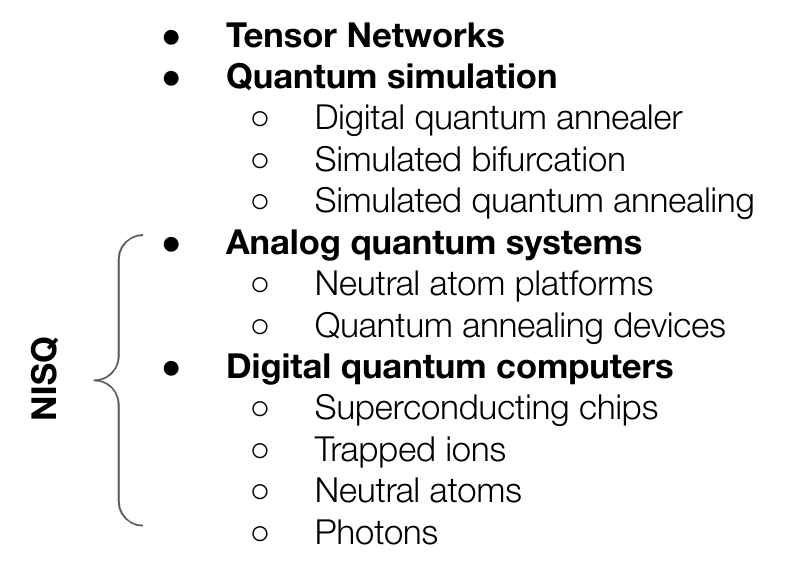
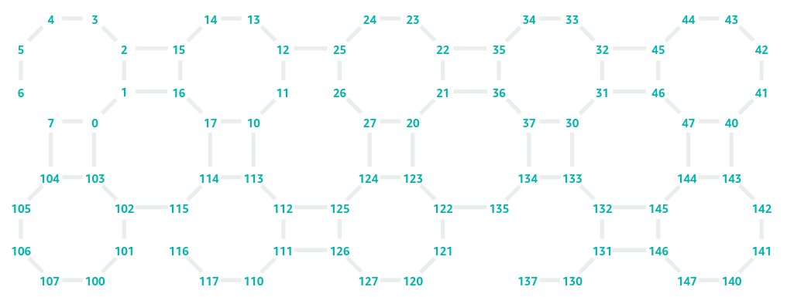
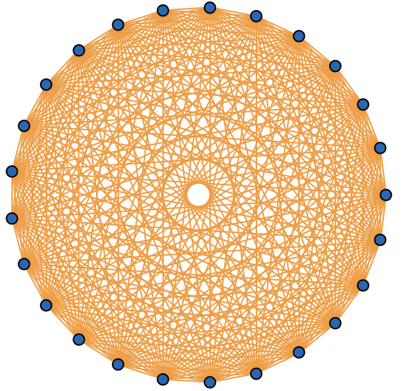
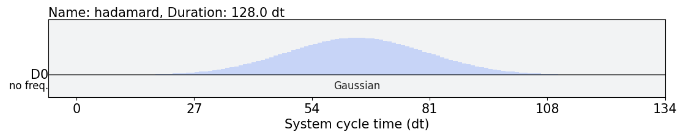
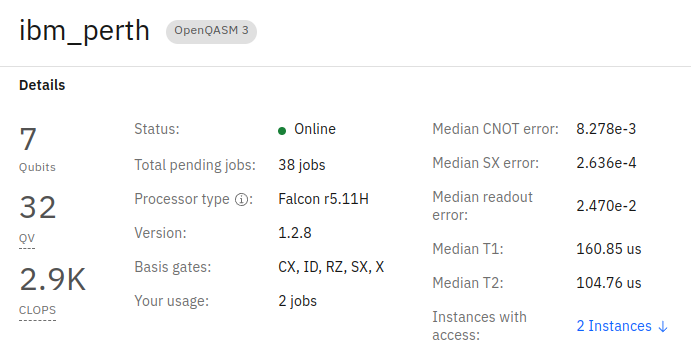
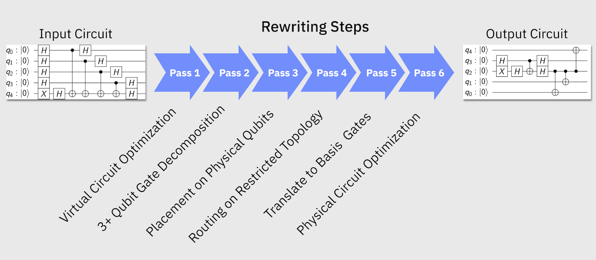
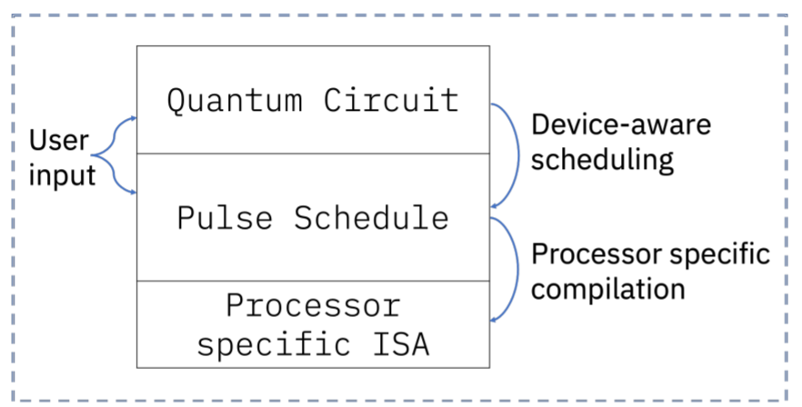
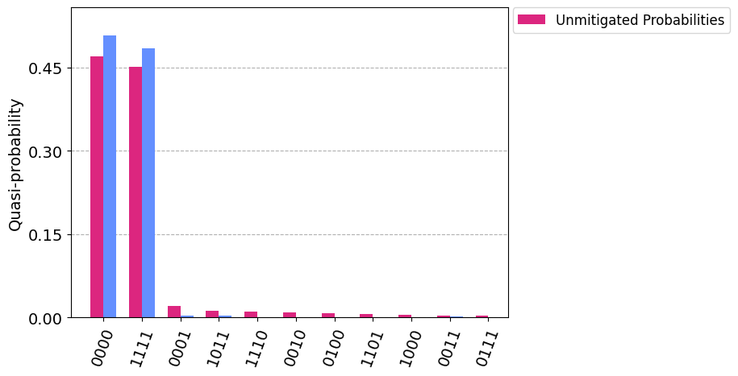

# Current offering {.unnumbered}

This is a tricky one, even though we love working with quantum computers, the key aspect is being able to solve _efficiently_ a given problem. And, at this stage, there are many competitors doing a great job at solving problems without the need for quantum computers, and it is important that while this field evolves we make the most out of their colleagues. All those, _quantum-inspired_ and _quantum-adjacent_ technologies.

<figure markdown>
{width=70%}
</figure>

From this family we have focused until now into the last bit, the **Noisy Intermediate-Scale Quantum (NISQ)** bit, the one related to actual quantum hardware but that does not mean those techniques and devices inspired by the challenges quantum mechanical systems pose are less than the actual hardware. In fact, one of the main problems to claim quantum advantage is the constant improvement and refinement of classical devices solving the same problems.

We highly recommend looking into **classical** and **quantum-inspired** solutions before jumping into the complexities of dealing with quantum hardware. There are really interesting results when it comes to classically emulating this formalism in the range of 10s to 100s of qubits and also hybrid approaches benefiting from specific aspects of the quantum domain, but heavily relying on classical processes (like Shor's algorithm in fact).

You have been warned!

## Hardware based implementations

Before we enter into more cumbersome and obscure techniques, lets understand the context in which we are trying to use Quantum Computing to outperform classical means. It is not a fair comparison as we count with almost 70 years of development in the classical regime while quantum computers even though have been used for almost 25 years since the first realization of the qubit, might require some extra work until a similar status of maturity and confidence is reached.

Following section will try to make the reader conscious about some of the issues they might face and how to tackle them, with a particular interest on Digital Quantum Computers.

### Quantum devices

We have seen many different devices exist but, even between the ones that are based on same technology we will find discrepancies on how they implement their operations. When this operations are fully parameterized we call them Gates but even though engineering makes a substantial effort bridging the gap between theoretical framework and physical reality, we might need to make our part as well.

#### Coupling maps

Coupling map refers to the connectivity between qubits. Most of our problems will be mapped to those qubits and we will need to define the strength of the action with respect to neighboring qubits. This ability to encode the interactions is reflected in the physical connection between the qubits on a given device and it is called the **coupling map**.

As an example, this is the coupling map of Rigetti:

And this one belongs to IonQ's Aria:

Seems like ino-traps may be a better fit to combinatorial optimization problems as they already count with all-to-all connectivity, but they lack the scale of superconducting devices. So, can we make anything to virtually connect those qubits on Rigetti's device all-to-all?

**SWAP gates**

The SWAP gate affects two qubits by interchanging their state, such that

$$
SWAP|\phi\rangle|\psi\rangle = |\psi\rangle|\phi\rangle,
$$

and its matrix form looks as follows

$$
SWAP = \left[
\begin{array}{cccc}
1 & 0 & 0 & 0 \\
0 & 0 & 1 & 0 \\
0 & 1 & 0 & 0 \\
0 & 0 & 0 & 1
\end{array}
\right].
$$

By iteratively applying this gates we can come up with a logical all-to-all connectivity even on sparsely connected devices. Swap strategies are quite common in the literature in particular when using superconducting devices. Different approaches can be found in the literature, and we will see in practice how it ends up being on reality, but in 2022 [@Weidenfeller_2022] they showed how adding interchanging SWAP layers produces an virtual all to all connectivity with minimal depth increase.

They we will simply need to introduce an appropriate amount of SWAP gates when needed according to our target device coupling map. The downside of it is that our circuit depth will increase, more operations are added, but that is not bad, is it?

#### Native gates

Our logical framework for quantum computing lands into different devices. As we already mentioned when discussing different device technologies, the actuation over the qubits is performed in different ways:

* Superconducting qubits use microwave pulses
* Ion traps use lasers
* Neutral atoms use lasers as well, in a slightly different manner

Therefore all operations need to find a translation that maps logical gates with the expected outcome of it, meaning a calibrated pulse needs to be found that renders the expected result. Following is the example of the Hadamard gate on a given qubit

A Gaussian shape pulse of 128 system cycle unit duration and an amplitude of 0.1. If this was the level required to work, probably less people would embrace quantum computing, therefore most companies offer an already calibrated set of operations that even though they are not the whole set of gates of the formalism, sets a basic and universal set of operations so that any logical circuit can be transform to those native gates.

If we access any of the IBM Quantum Computing devices we can see how they already show relevant information where we can encounter those natively accessible gates named as the _basis gates_

* ID is the identity operation
* X is the NOT gate and [SX](https://qiskit.org/documentation/stubs/qiskit.circuit.library.SXGate.html), the $\sqrt{X}$
* RZ is the rotation over the $Z$ axis given an angle $\theta$
* CX is our only two-qubit gate and represents the CNOT

Then, if we only have a CNOT gate how could we implement the SWAP gates we needed in order to create an all-to-all connected circuit? Tricky as it might be we need to find a way to decompose our logical gates into the gates we have available [@gokhale2021fasterreliablequantumswaps].

### Transpilation

Transpilation refers to the systematic approach of changing a logical circuit to fit under the basis gates and coupling map for a given device. Reminds to the old compilation step needed in computer programs to fit a given architecture but in this case, given that still converts our source code in a different source-code, transpilation is the appropriate name.

These logical steps, once transpiled can be interpreted by the device knowing the type of pulse that needs to be sent to each qubit to represent the requested operation.

IBM counts with one of the most mature transpilation modules out there and it is often used to translate the logical circuits to specifications for other devices. It is composed by different circuit _passes_ focusing on fixing specific issues between logical circuit and physical device.

At the end you will see the representation fo the pulsed schedule that is finally submitted to the deive following the architecture layer as in the image below.

{width=60%}

More on this can be found on [IBM's documentation](https://qiskit.org/documentation/tutorials/circuits_advanced/04_transpiler_passes_and_passmanager.html)

### Noise

And if that wasn't enough, we saw on previous exercise our quantum devices are far from perfect. Operations not always turn out as expected:

* Measurement or Readout error
* Operation error rates

And given the limited coupling ability and native gate translation, more operations than initially required need to be added to the final circuit. 

{width=60%}

All this goes against the effort we have put when trying to solve our problem accurately using quantum computers. But, there is people researching on how this effect can be minimized or suppressed, so let's see a couple of examples. It is also relevant to clarify the lingo as it might get messy.

**Error suppression**

Error suppression aims to leverage knowledge about the system and its fundamental errors to suppress their effect when someone runs a given circuit on those devices. It is often found at a fundamental level, really close o the hardware itself and should be easy to abstract the final user from these actions as they mostly require little knowledge about the executing circuit.

A clear example of this techniques is _Dynamical Decoupling_. A techniques that introduces operations when qubits are idling so that they do not get affected by the surrounding qubtis and operations taking place.

Derivative Removal by Adiabatic Gate (DRAG) as an additional example, adds a component to the standard pulse shape to reduce qubits entering states higher than the 0 and 1 states we use for calculations. These techniques aim to fix fundamental issues related to the physical implementation.

**Error mitigation**

These techniques try to diminish the effect of noise during the execution by compensating for the systematic issues of the device itself. We could statistically characterize the systematic error upon redout and compensate for it after execution of the circuit.

Or when expectation value is obtained, characterize the noise level and extrapolate the value we would have obtained in absence of noise for a given device.

{width=60%}

Simple actions like layout selection, trying to select those qubits with less error on them or surrounding qubits might be simple and powerful enough for small circuits but it gets challenging on real use cases where depth and connectivity increase significantly.

**Error correction**

Error correction refers to the ultimate goal of many quantum computing companies, in particular hardware providers, where a logical implementation using redundant physical actions may lead to fault-tolerant device. The trick here is that our qubits will be a logical representation of what we have seen until now

$$
|0\rangle_L = |000000000\rangle
$$

And therefore, operations should also be modified to represent the actions on all physical qubits behind our logical actions. Below example is one of the canonical examples of error correcting codes designed by Peter Shor.

{width=60%}

**Fault Tolerant Quantum Computing** would be the ideal scenario where a final user would only care about the logical implementation and the machine would deal with redundancy to fix errors and return the actual execution of the code in absence of noise. Sadly, we are still far from this future as it requires between hundreds and thousands of physical qubits to implement single logical qubits, increasing the scale up to million qubits needed for meaningful computation (see [Google's journey map](https://quantumai.google/learn/map)). 

Therefore, we need to invest some time on manual error fixing and mitigation. Even though these techniques may sound complex, current status of frameworks such as Qiskit may help [bridge the gap](https://docs.quantum-computing.ibm.com/optimize).

### Additional means

Well, I hope this wasn't too intense. We got down to the inner workings of available Quantum Services and listed some of the impediments we might face when moving to actual devices. We did focus on Digital Quantum Computers being the ones that allow to move beyond the service offered by Quantum Annealers but does not require so much understanding as Analog Quantum Computers.

Being aware of the techniques that can be used we also showed how easy it is to implement those on actual devices on IBM's Qiskit Runtime. Other cloud providers may enable other devices but will require additional knowledge on how to implement those techniques. We can benefit of some of the methods made available by Unitary Fund's open-source community or niche players like Q-Ctrl:

* [Mitiq](https://mitiq.readthedocs.io/en/stable/)
* [Fire Opal](https://q-ctrl.com/fire-opal)
* [Superstaq](https://superstaq.readthedocs.io/en/latest/)

Most likely quantum computing service providers will increase the abstraction making easier to implement algorithms in real hardware but for the moment, some work still needs to be done on our end as we saw. Let's stick to simulators and emulators for now.