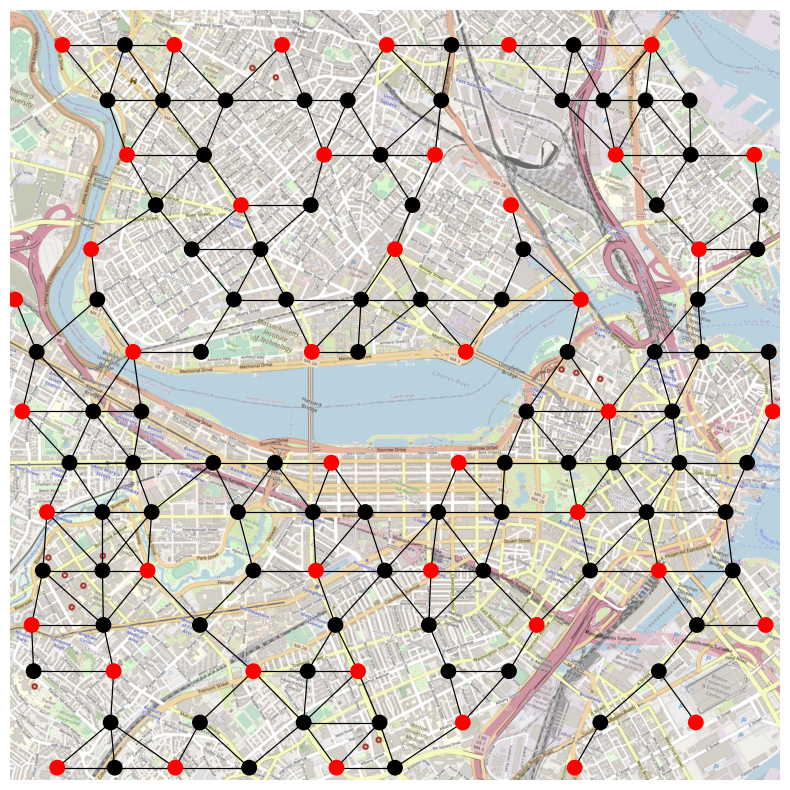
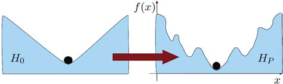
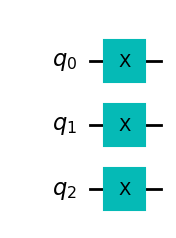
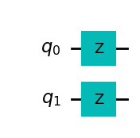

# Machine types {.unnumbered}

We have talked about how the hardware works but not all Quantum Computers work in the same way. Just talking about pure quantum computers three main types of computers can be found.

## Analog devices

Like in the very beginning of computers, managing analog signals is the natural way to start when trying to domesticate physical phenomena to reproduce a particular set of steps. There do exist machines with well characterized qubits but requiring a specific way to interact with them. This is the case of neutral atom platforms, a Hamiltonian is provided that acts on the system and our duty is to define the signals that will drive the system towards the solution of our problem. These atoms are well defined qubits but manipulating them according to the mathematical framework can be challenging, therefore it is easier (in some sense) to drive the whole system by signal manipulation (hence analog computation). 

The Hamiltonian on those devices looks as follows,

$$
\frac{\mathcal{H}(t)}{\hbar} = \sum_j \frac{\Omega_j(t)}{2} \left( e^{i \phi_j(t) } | 0_j \rangle  \langle 1_j | + e^{-i \phi_j(t) } | 1_j \rangle  \langle 0_j | \right) - \sum_j \Delta_j(t) \hat{n}_j + \sum_{j < k} V_{jk} \hat{n}_j \hat{n}_k,
$$

where $|0_i\rangle$, $|1_i\rangle$, and $\hat{n}_i = 0|0_i\rangle\langle0_i|+1|1_i\rangle\langle1_i|$ refer to qubits $i$ position for a given space. Defining algorithms requires manipulating the time-traces of the Hamiltonian parameters $\Omega_i(t)$, $\phi_i(t)$, and $\Delta_i(t)$. The Rabi term $\Omega$ and detuning $\Delta$ introduce energy scales that compete with the geometrically controlled scale $V_{ij}$.

These machines natively solve a mathematical problem called, _maximum independent set_. Each atom has a blockade radius that prevents to atoms (qubits) being active at the same time (both being $|1\rangle$). If we are able to encode our problem, the machine could without effort compute the most efficient points in a map where one should place specific assets based on their surroundings. More on about this on [QuEra's documentation site](https://queracomputing.github.io/Bloqade.jl/dev/tutorials/1.blockade/main/)

Look at this reference on how to interact with QuEra devices using Amazon Braket service and their [SDK](https://docs.aws.amazon.com/braket/latest/developerguide/braket-quera-submitting-analog-program-aquila.html). It is easier than it looks but one needs to definitely know how to translate the problem to be solved to that formulation. These devices are often limited to a set of mathematical problems that requires users to think how their actual business problem may fit into those setups. As an example, here is a candidate problem on where to place antennas in Boston to minimize the cost but maximize coverage.

<figure markdown>

</figure>

* [Example](https://github.com/QuEraComputing/QuEra-braket-examples/blob/main/OptimizationTutorial/AWS_nonadiabatic_optimization_demo.ipynb) for above picture
* General on MIS for neutral atoms: [https://arxiv.org/pdf/2109.03517.pdf](https://arxiv.org/pdf/2109.03517.pdf)

Most likely, as it has happened with the rest of the machines, they will grow into the direction of digitized operation. A hint on previously mentioned _native_ gates: defining a set of parameters that translated our device Hamiltonian to the gates we would like to use, is part of the magic many hardware providers perform through programming frameworks so that we don't have to worry too much about it.

## Quantum Annealers

In 1998, Hideyoshi Nishimoru from Tokyo University demonstrated that quantum annealing could outperform classical annealing techniques used up to that moment for optimization and combinatorial tasks. Quantum Annealers work by starting the system at a know state and by performing little perturbations to the system provide the solution to a target state. Its universality has been proven 

[Adiabatic quantum computing (AQC)](../algorithms/adiabatic.md) is a model of computation that uses quantum mechanical processes operating under adiabatic conditions. As a form of universal quantum computation, AQC employs the principles of **superposition, tunneling, and entanglement** that manifest in quantum physical systems.

<figure markdown>

</figure>

D-Wave, was one of the first ones to produce a commercially available quantum computer with _thousands of qubits_. A clear milestone in the path towards commercially making it viable.

A big caveat of this machine, is that it can only work using the adiabatic evolution as the main process. This means we can only govern the inner workings of the machine up to a point. Annealers work in precise manner so they do not allow for the flexibility digitized computers do, making them closer to an analog machine with restricted programming ability.

These machines are able to solve a complex problem indeed. In general any Quadratic Unconstrained Binary Optimization (QUBO) problem fits into the general framework of using annealers to solve the minimum energy state for a Ising type of problem:

$$
H = -\sum_{\langle i j \rangle} J s_i s_j - \sum_j h s_j.
$$

We will see this more in detail when covering the inner workings of annealers but, think that if your problem fits into this type of mathematical formulation, you may find an ally when it comes to Quantum Annealers.

## Digital quantum computers

In order to provide certain level of universality when it comes to operations, digitization of the interactions with the quantum computer and the states it encodes has become a critical path towards quantum device commercialization. Managing Hamiltonians is still necessary but the way in which these need to be introduced into the machine could be handled by atomic operations (logical gates) with which we can compose higher level operators or create more complex dynamics taking us closer to how classical computers operate, enabling incremental instruction addition and higher level abstractions.

Digitized computers work by enabling a set of digitized operations so that we can implement our routines. The initial state of the system would still be $|00...0\rangle$ so if we would like to transform this state into $|11..1\rangle$ we should find the Hamiltonian that does it.

A not operation, like in classical computers, is one of the basic actions:
$$
X^{\otimes n} |0\rangle^{\otimes n} = |1\rangle^{\otimes n}
$$

A simple composition of $X$ (not) operation on each qubit. Therefore, we could express it in a pictorial way:

<figure markdown>

</figure>

That way it is quite simple to understand what are the atomic operations required and have a programming language that abstracts us from signals and pulses.

As an example, a unitary transformation characterized by $U = Z_1 \otimes Z_2$ leads to a simple implementation

```py
OPENQASM 2.0;
include "qelib1.inc";

qreg q[2];
rz(pi/2) q[0];
rz(pi/2) q[1];
```

<figure markdown>

</figure>

This approach makes _programming_ these machines really close to the way in which classical devices were programmed in the early days.

We should pay attention though that this _logical_ framework is often complicated to represent by physical means, therefore we will see some discrepancies when we start looking into what are called _native_ gates. This will become clear when we start with our exercises against real hardware. Let's keep the joy of playing with quantum simulators for now.
