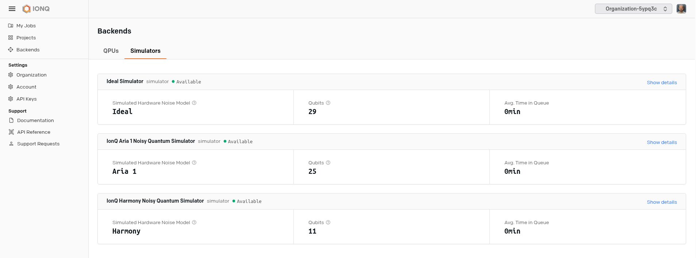

# Service providers {.unnumbered}

Most of these machines cannot be purchased; or their cost would be way beyond any potential return of investment. They are quite expensive and require active maintenance so, lucky for us, we do count with the ability to interact with remote machines from our workstations. That way we can _rent_ their usage and let others do the nasty work of maintenance. Most hardware providers offer their quantum computing machines as a service, so we can ask for computation time and send our circuits/algorithms to be executed on those. This was really common for Universities and research institutions when requesting time on a supercomputing or HPC resource but since the creation of the cloud it is also a well extended practice between data and analytics departments where ephemeral resources may make sense to be used due to the experimental nature of a given initiative.

We will guide on how these services can be enabled from players providing themselves the service as well as cloud providers where a wider variety of machines can be found.

## Direct service providers

### D-Wave

D-Wave is known to be one of the first companies to make their quantum computers commercially available (2011). This Canadian niche player built quantum annealing machines so that people could... buy them? Well probably that was part of their intention, but these are big expensive machines yet to prove their usefulness. Luckily in 2018 they released their cloud solution [DWave Leap](https://cloud.dwavesys.com/leap/login).

Their cloud access allows some free time on these machines so that users can evaluate their usefulness and advantage to solve specific problems.

<figure markdown>

</figure>

The dashboard offers information about the remaining available usage time and there are options to open a browser based Integrated Development Environment (IDE) or access the documentation for use cases that may help get started with this service.

We already discussed that Quantum Annealers are a different type of beast, so they might require different ways to instruct what to do. That is why DWave had to leverage also Python based Software Development Kits so that people could interact with their machines (exclusively).

[Ocean software stack](https://docs.ocean.dwavesys.com/en/latest/overview/install.html)

By attaching a GitHub account the initial 20 min. access is extended to a monthly time allowance where their purely quantum devices as well as hybrid solvers will be available.

<figure markdown>

</figure>

### IBM

IBM has been involved since the early days in the development of quantum computers. Superconducting chips are at the core of what they can provide, and probably you have already seen some images on how their machines look like, so now you know what is inside this huge cylinder.

<figure markdown>

</figure>

It is said that IBM representatives asked at a conference how many of the attendees would actually interact with a quantum computing service to send their experiments if IBM would allow for such access. Apparently a huge amount of people raised their hands and that gave birth to IBM's Quantum Computing platform [https://www.ibm.com/quantum)](https://www.ibm.com/quantum) and the framework that enabled the communication and experiment implementation, Qiskit.

<figure markdown>

</figure>

We could either use online resources available there, such as the Quantum Lab (a Jupyter based IDE) or get the API token to interact from our local machine by means of Qiskit. Same devices will be available for our experiments in both cases.

<figure markdown>

</figure>

## Cloud hosted services

Not all companies have the ability to develop and maintain an online customer facing service as their focus may be more on the hardware development side, and they could benefit from partnerships where this is done by a third party. Cloud providers already aware of this, decided to step in and create a service so that others could host their quantum computing services.

### Amazon Braket

AWS created a service called Amazon Braket so that people already using their cloud services could simply add quantum computing resources as an extra to their current stack. It offers similar experience to IBM's or DWave, but the main benefit is the access to devices other than IBM's or DWave's.

<figure markdown>

</figure>

One can use their Software Development Kit (Braket SDK) which could be necessary for some devices not providing digitized gates but in general, due to the agreement on digitized instructions there it does exist an integration between both languages Amazon Braket SDK and IBM's Qiskit.

### Microsoft Azure

Similarly, Azure created a service that provides access to a set of devices some of them only being accessible in this platform (Quantinuum for example). Quantum Workspaces is the name, and it also offers a Jupyter based IDE for online experimentation.

<figure markdown>

</figure>

Microsoft created their own quantum computing framework called Q# but given the maturity of Qiskit, plugins do exist so that programmers won't need to switch frameworks.

### Direct providers

Some companies, like IonQ, do provide direct access to their simulators, emulators and devices via their cloud hosted service. This is the case of [IonQ's Cloud](https://ionq.com/quantum-cloud) service. Anyone can sign up and request access to the simulators and QPUs available there.

<figure markdown>

</figure>

## Third party providers

There do exist some intermediary providers that position themselves between the hardware access and the developer experience. Definitely interesting to look at their offering as it evolves:

* [Strangeworks](https://strangeworks.com/)
* [qBraid](https://www.qbraid.com/)
