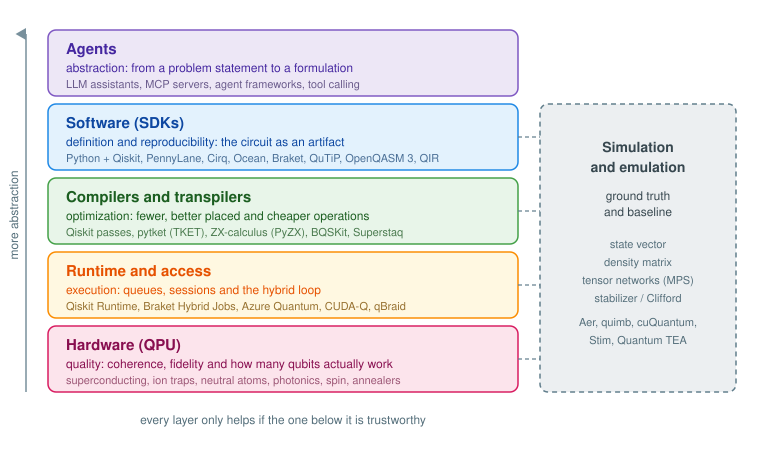

# The quantum computing stack {.unnumbered}

We have seen how these machines are built, who rents them to us and what goes wrong once we send a circuit. Time to zoom out and look at the whole thing.

Classical computing settled into a stack a long time ago. Nobody writing a web application thinks about the instruction scheduler, and nobody designing a CPU worries about JavaScript. Each layer made a promise, kept it, and the layer above stopped caring. Quantum computing is in the middle of building that same structure, only the layers are still visible and leaky, so it pays to know which one we are standing on. Most frustration in this field comes from blaming the wrong layer.

<figure markdown>

</figure>

Read it top-down if you want to follow a problem on its way to a machine, or bottom-up if you want to know what the machine can actually offer. Either way, each layer has exactly one job.

## Agents: abstraction

At the very top there is someone who has a problem, and that problem is stated in the language of their domain. A delivery fleet that has to visit 60 addresses. A molecule whose ground state energy someone needs. A portfolio with constraints on how much can go into each sector. None of this is a quantum circuit yet.

Turning that into something a quantum algorithm can consume is the job of this layer: choosing a formulation (a QUBO, a Hamiltonian, a feature map), choosing an algorithm that fits both the formulation and the available hardware, and wiring the classical-quantum loop around it. For most of the short history of this field that job belonged to a person, usually an expensive one, and it is still the main bottleneck for adoption. You cannot hire your way out of a talent shortage.

What is changing is that this layer is being partially automated. Not the physics, the translation work:

* **Coding assistants** trained or fine-tuned on the SDKs, like the [Qiskit Code Assistant](https://quantum.cloud.ibm.com/docs/en/guides/qiskit-code-assistant), which turn "build me a hardware-efficient ansatz for this Hamiltonian" into something that runs.
* **Tool calling and MCP servers** so that a model does not have to guess. It can query the coupling map of a backend, look up its current calibration, transpile a candidate circuit and read back the two-qubit gate count before deciding anything. Providers like [qBraid](https://docs.qbraid.com/) already expose their services this way.
* **Agent frameworks** that split the work into formulation, implementation and verification, so the piece that writes the circuit is not the same piece that judges whether it is correct.
* **Retrieval over documentation and papers**, which matters more than it sounds in a field where the recommended way of doing something changes every couple of releases.

Now, a warning. This is the youngest and least reliable layer in the stack, and it fails in a particularly unpleasant way: it produces code that runs. When [@vishwakarma2024qiskithumanevalevaluationbenchmark] benchmarked models on hand-written Qiskit tasks, the models did generate executable quantum code, but success dropped sharply as tasks got harder, and executable is a very low bar here. A circuit built on the wrong Hamiltonian will happily return a histogram, and that histogram will look exactly like a valid result.

So the rule for this layer is simple: the agent proposes, the stack verifies. Abstraction is only worth having when the layers below can check what came down from above, which is a good reason to care about the next one.

## Software: definition and reproducibility

This is where the algorithm stops being a drawing on a whiteboard and becomes an object. Something you can serialize, version, hand to a colleague and run again in six months.

Python won this layer, for better or worse, and the ecosystem grew around it:

* **[Qiskit](https://www.ibm.com/quantum/qiskit)** is the reference point for gate-based work, and even people targeting other vendors tend to write in it and convert later.
* **[PennyLane](https://pennylane.ai/)** treats circuits as differentiable functions, which makes it the natural choice when the circuit sits inside a training loop.
* **[Cirq](https://quantumai.google/cirq)** for Google devices, **[Braket SDK](https://aws.amazon.com/braket/)** for the AWS catalogue, **[Ocean](https://www.dwavequantum.com/solutions-and-products/ocean/)** for annealing and QUBO formulation, **[Bloqade](https://queracomputing.github.io/bloqade-analog/latest/)** for neutral atoms and **[QuTiP](https://qutip.org/)** when you need the dynamics rather than the gates.
* **[Qibo](https://qibo.science/)** sits slightly apart, acting as middleware between a single way of writing things and several backends.

Underneath the SDKs there is an interchange level that does not get enough attention. **[OpenQASM 3](https://openqasm.com/)** [@Cross_2022] describes circuits including real-time classical control, timing and pulse level detail, and **[QIR](https://www.qir-alliance.org/)** takes the LLVM route so that quantum programs can be handled by tooling that already exists in the compiler world. These formats are the reason a circuit written in one SDK can be executed by a vendor who never heard of that SDK.

And then there is the part everyone skips. Reproducibility in quantum computing is harder than in a normal Python project because the result depends on things outside your code:

* Pin the environment. A lockfile and `uv sync` cost nothing and save an afternoon. Transpilers in particular change their output between minor versions, so "same script, different answer" is a normal Tuesday.
* Fix the seeds. Shot sampling, optimizer initialization and the transpiler's own layout search are all stochastic.
* Record the backend **and** its calibration snapshot. The same circuit on the same device two days apart is not the same experiment, and if you did not write down which qubits you were given, you cannot explain the difference later.
* Serialize the circuit that was actually submitted, not the one you wrote. Between the two there is a transpiler, and it may have changed rather a lot.

```bash
uv init my-quantum-experiment
uv add qiskit qiskit-ibm-runtime pytket-qiskit
uv lock
```

Boring, and the single highest return activity in the entire stack.

## Compilers and transpilers: optimization

We already met [transpilation](challenges.md) when we saw that our logical circuit does not fit the device it is going to run on. What matters here is that this is a layer with competing implementations, and they are swappable. You are not obliged to use the one that shipped with your SDK.

What is being optimized, in rough order of how much it hurts:

* **Two-qubit gate count.** These are one to two orders of magnitude noisier than single-qubit gates. It is the number to look at first, and often the only one that matters.
* **Depth**, because idle qubits decohere while their neighbours are being operated on.
* **Layout and routing**, mapping logical qubits onto physical ones so that the interactions your algorithm needs match the connectivity the chip actually has, and inserting SWAPs where they do not.
* **Non-Clifford count**, the number of $T$ gates, which is irrelevant today and the dominant cost once error correction arrives, since those are the expensive ones to implement fault-tolerantly.

The tools worth knowing:

* **[Qiskit's transpiler](https://quantum.cloud.ibm.com/docs/en/guides/transpile)**, organized as pass managers with optimization levels from 0 to 3, plus the AI-driven passes offered through their transpiler service. Mature, well documented and the default for good reason.
* **[pytket](https://tket.quantinuum.com/)**, Quantinuum's TKET compiler [@Sivarajah_2020]. It was designed from the start to be retargetable and vendor-agnostic, and it plugs into the SDKs, so you can keep writing Qiskit and compile with TKET through `pytket-qiskit` if the numbers come out better.
* **[ZX-calculus](https://zxcalculus.com/)** [@vandewetering2020zxcalculusworkingquantumcomputer], which is a different idea altogether. Instead of treating the circuit as a sequence of gates, it is rewritten as a graph where the gate structure dissolves, simplified with a small set of local rewrite rules, and then a circuit is extracted back out. Because the intermediate object is not a circuit, it finds simplifications that gate-by-gate rewriting cannot see. [PyZX](https://github.com/zxcalc/pyzx) is the usual entry point, and this approach is particularly strong at phase and $T$ count reduction, which is why the error correction community cares about it.
* **[BQSKit](https://bqskit.lbl.gov/)**, which takes numerical resynthesis: cut the circuit into blocks, compute each block's unitary, and search for a shorter sequence that reproduces it up to a tolerance you choose. Trading a controlled amount of accuracy for a shorter circuit is often an excellent deal on noisy hardware.
* **[Superstaq](https://superstaq.readthedocs.io/en/latest/)**, which compiles device-aware across several vendors and will happily go below the gate level when the hardware allows it.

And below the gates there is the pulse level, where a gate becomes a shaped microwave or laser signal. [Qiskit Dynamics](https://qiskit-community.github.io/qiskit-dynamics/) and [Pulser](https://pulser.readthedocs.io/) for Pasqal devices live here, along with the analog Hamiltonian control we saw for neutral atoms. Most people never need to go down there, which is exactly the point of having layers.

One habit to build: count the two-qubit gates before and after compiling, on every run. It takes one line and it is the best early warning you will get that the result is going to be noise.

## Simulation and emulation: ground truth

This one does not sit above or below anything, it runs alongside the whole stack, and it plays two very different roles.

The first is debugging. For small instances you can know the exact answer, which means you can tell whether your formulation was wrong, your circuit was wrong or the hardware was just noisy. Without this, all three failures look identical.

The second role is less comfortable: this is the competition. Classical methods keep getting better, and the honest question before spending hardware credits is whether a classical method already solves your instance. We covered the methods in [classical resources](../gettingstarted/classicalqc.qmd), so just the map here:

* **State vector** for exact small circuits, roughly up to 25 to 30 qubits before your memory gives up.
* **Density matrix** when you need noise in the picture, at quadratic cost.
* **Tensor networks** for the cases where entanglement stays bounded.
* **Stabilizer simulation** for Clifford circuits, where [Stim](https://github.com/quantumlib/Stim) [@gidney2021stimfaststabilizercircuit] handles millions of gates in seconds. If you work on error correction, this is your main tool rather than a fallback.

Tensor networks deserve the extra sentence. They do not represent the full state, they represent the correlations, and they only pay for the entanglement that is actually present. A shallow or weakly entangled circuit contracts far beyond what a state vector could ever hold, which is precisely why several claims of quantum advantage have been walked back after someone reproduced them classically [@xu2023herculeantaskclassicalsimulation]. The practical tools are [quimb](https://quimb.readthedocs.io/en/latest/index.html), [NVIDIA cuQuantum](https://developer.nvidia.com/cuquantum-sdk) for GPU contraction, [Quantum TEA](https://www.quantumtea.it/) and [TensorKrowch](https://joserapa98.github.io/tensorkrowch/_build/html/index.html), plus the MPS backends already built into Aer and PennyLane.

So the rule for this layer: if a matrix product state with a modest bond dimension solves your instance, you do not need a QPU yet. That is not a defeat, it is a saved budget, and knowing where that boundary sits for your problem is one of the more valuable things you can measure.

## Runtime and access: execution

Between a compiled circuit and a chip there is a queue, a session, a calibration cycle and a scheduler, and this layer is what turns "I have a circuit" into "I have results".

It sounds like plumbing until you try to run a variational algorithm. A thousand optimization iterations, each one requeued from scratch behind other users' jobs, is not an experiment, it is a weekend. That is what this layer buys you:

* **[Qiskit Runtime](https://quantum.cloud.ibm.com/docs/en/guides/primitives)** with its Sampler and Estimator primitives, sessions that hold your place in the queue across a loop, and error mitigation applied server side so you do not have to implement zero noise extrapolation yourself.
* **[Braket Hybrid Jobs](https://docs.aws.amazon.com/braket/latest/developerguide/braket-jobs.html)**, which colocate the classical part next to the QPU for the same reason.
* **Aggregators** like [qBraid](https://www.qbraid.com/) and [Strangeworks](https://strangeworks.com/), which give one interface over many vendors and absorb the credential handling.
* **HPC integration**, which is where this is heading. [CUDA-Q](https://developer.nvidia.com/cuda-q) and the [Munich Quantum Software Stack](https://www.munich-quantum-valley.de/research/consortia/q-dessi) treat the QPU as an accelerator sitting next to GPUs in a supercomputing centre, scheduled through the same job system as everything else. Given how much of every quantum algorithm is classical, this is probably the shape the future takes.

## Hardware: quality

Everything above is a promise. This is where it gets kept or it does not.

Qubit count is the headline number and the least informative one. What determines whether your circuit produces anything are:

* **$T_1$ and $T_2$**, how long a qubit keeps its state and its phase.
* **Gate fidelity**, single-qubit and, far more importantly, two-qubit.
* **Readout error**, which is often the largest single contribution and the easiest to mitigate.
* **Connectivity**, since a sparse coupling map means SWAPs, and SWAPs mean more two-qubit gates.
* **Speed**, measured as something like CLOPS, which decides whether a variational loop finishes today or next week.

Averages of these lie, though, because they are usually measured on the best qubits in isolation. Quantum Volume improved on that by testing width and depth together, but it still rewards the highest quality subset of a device. **Layer fidelity** and its derived error per layered gate (EPLG) [@McKay_2023] were introduced to measure what happens when many qubits are operated simultaneously across the whole chip, which is the regime any real algorithm runs in. When comparing devices, that is the number to ask for.

The technologies, with the players building on each:

* **Superconducting**: IBM, Google, Rigetti, IQM, OQC, and the bosonic variants from Alice & Bob and Nord Quantique that build error protection into the qubit itself.
* **Trapped ions**: IonQ, Quantinuum, AQT. Excellent fidelity and all-to-all connectivity, slower gates and fewer qubits.
* **Neutral atoms**: Pasqal, QuEra, Atom Computing, planqc. Large arrays, reconfigurable geometry, and the analog mode we saw earlier.
* **Photonics**: Xanadu, PsiQuantum, Quandela, ORCA. Room temperature operation and a different set of problems entirely.
* **Silicon spin**: Diraq, Quantum Motion, SQC, Equal1, betting that the semiconductor industry's manufacturing base eventually wins.
* **Annealers**: D-Wave, still the only ones with a decade of commercial operation behind them.

All of them are heading towards the same destination, error correction, where a logical qubit is built from hundreds or thousands of physical ones and the layers above finally get to stop thinking about noise. We are not there, which is why the [challenges chapter](challenges.md) exists.

## Reading the stack in practice

Take the MaxCut problem we keep coming back to, and follow it down:

1. **Agents** turn "partition this network so that the cut is maximal" into a QUBO, pick QAOA over VQE because the cost Hamiltonian is diagonal, and write the first version of the code.
2. **Software** fixes what that means exactly: this graph, this number of layers, this optimizer, these seeds, this version of Qiskit, all committed and reproducible.
3. **Compilers** take the resulting circuit, which assumes all-to-all connectivity it will not get, and turn it into something the chip can execute, hopefully without tripling the two-qubit gate count.
4. **Simulation** runs the same thing exactly for a small graph, so we know what the right answer looks like, and runs a classical solver on the full graph, so we know what we are competing against.
5. **Runtime** keeps the session open across the optimization loop and mitigates readout error on the way back.
6. **Hardware** decides whether any of it survives.

If the result is wrong, the layer that failed is usually identifiable: a formulation error shows up in simulation too, a compilation problem shows as an explosion in gate count, and a hardware problem shows as a result that degrades as you add layers. Different failures, different fixes, and this is why keeping the layers separate in your head is worth the effort.

## Cheat sheet

| Layer | What it brings | Tools and techniques | Symptom when it is weak |
|---|---|---|---|
| Agents | Abstraction | LLM assistants, MCP servers, tool calling, agent frameworks | Plausible code solving the wrong problem |
| Software | Definition and reproducibility | Python + Qiskit, PennyLane, Cirq, Ocean, Braket, QuTiP, Qibo, OpenQASM 3, QIR, uv | Results nobody can reproduce, including you |
| Compilers | Optimization | Qiskit passes, pytket (TKET), ZX-calculus (PyZX), BQSKit, Superstaq, pulse level control | Circuit depth explodes, output becomes noise |
| Simulation | Ground truth and baseline | State vector, density matrix, tensor networks (quimb, cuQuantum, Quantum TEA), Stim | No idea whether the hardware or the code is wrong |
| Runtime | Execution | Qiskit Runtime, Braket Hybrid Jobs, Azure Quantum, CUDA-Q, qBraid, Strangeworks | Variational loops that never finish |
| Hardware | Quality | Superconducting, ion traps, neutral atoms, photonics, spin qubits, annealers | Everything above it was theatre |

Today most of the value in this stack sits in the bottom half, and that is where the money goes. But the interesting thing about layers is what happens when the ones underneath get good enough to stop worrying about. Every improvement at the bottom raises the value of the top, because the constraint moves from "can this run at all" to "did anyone ask the right question". We are not there yet. It is worth building the habit now.
