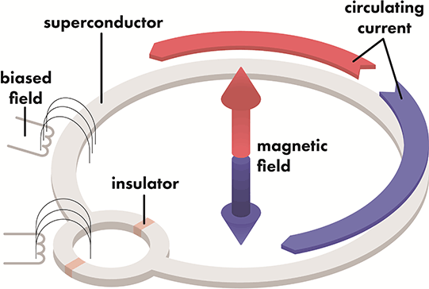
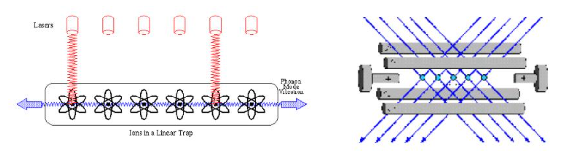

# Technology {.unnumbered}

In order to create a machine that is able to execute the mathematical framework described by quantum computation, different technologies can be used.

## Superconducting chips

Superconducting qubits are implemented using macroscopic elements build using a LC electrical circuit. The effect of an electrical resonator is observed at specific work temperatures below 15mK which requires building quite large dilution refrigerators. One of the main disadvantages of this technology is their susceptibility to environment noise (sources being dielectric of surrounding metal or surrounding energy radiations) that cause short coherence times.

<figure markdown>
  
</figure>

Probably one of the most mature implementations when it comes to qubit realization. Companies like IBM, Intel, Google or D-Wave base their devices in this technology. The most popular qubit, the transmon, offers coherence times between 50 and 100 $\mu$s with operation times in the order of nanoseconds (fastest: 18 ns demonstration in 2019). This leaves an operation ratio of $10^{4}$ satisfying 3rd DiVincenzo criteria. Qubit fidelity reach the 99.95% with experiments reporting 99.66% for two qubit gate in 2016. 

Works by controlling the current flow through the superconducting circuit and those current flows can be operated using microwave pulses. Different pulse configurations (length, amplitude or phase) represent the potential digitized gates one could find.

Circuit topology is often limited to nearest-neighbor couplings, which limits the implementation of densely connected algorithms.

These devices can handle up to 433 qubits (IBM's Osprey architecture) on their digital version but D-Wave's annealing machine counts with up to 8000 qubits to be used.

| Provider             | Max. Qubits   |
| -------------------- |:-------------:|
| D-Wave               |   8000        |
| IBM                  |   433         |
| Rigetti              |   80          |
| OQC                  |   32          |

To know a bit more about the inner workings, go to [Xanadu's thorough explanation](https://pennylane.ai/qml/demos/tutorial_sc_qubits).

## Trapped ions

Initially proposed by Cirac and Zoller [@cirac1995quantum], ions are confined into traps making up the quantum computer composed of those.

<figure markdown>
  
</figure>

Pairs of internal electronic states of ions are implemented as the base qubit states $|0\rangle$ and $|1\rangle$. They can be any combination of long-lived levels, differentiated by the separation of their energy levels. The 2 most predominant ones are hyperfine levels, separated by gigahertz frequencies; and optical levels, separated by frequencies of hundreds of terahertz.

After the ions are loaded into their traps, the qubits are optically pumped into the fiducial state of $|1\rangle$. The methodology of gate operation via state transition is dependent on the type of trapped-ion qubit. For optical qubits, a laser with a resonant frequency equal to the state transition is used whereas gate operations on hyperfine qubits can be performed either with lasers using stimulated Raman Coupling or with microwaves directly addressing the giga-hertz energy level splitting.

The state-dependent readout is carried out by lasers as well. Using contemporary methods, readout fidelities of over 99.9% have been achieved within microseconds [@myerson2008high;@crain2019high].

Ion-traps count with a virtual all-to-all connectivity that allows for any qubit to qubit interaction. Shortcomings can be attributed to the decrease of the speed and fidelity of 2 qubit gates as the number of ions in the chain increases though. As the size of the ion chain increases, its mass increases as does the average distance between ions. This in turn leads to a decrease in the coupling strength between arbitrary ions, causing a decrease in speed of 2 qubit gates. Fidelity decreases due to the increased susceptibility among the normal modes used to mediate the 2-qubit interaction to unwanted spectral crosstalk interaction, as well as to noise-induced heating in the system if the gates take longer.

A way to circumvent this problem is to break up the long linear chain into smaller modules, and it is still the barrier many device manufacturers in this regime need to work on.

| Provider             | Max. Qubits   |
| -------------------- |:-------------:|
| IonQ                 |   23          |
| Quantinuum           |   32          |

More on their current specs can be found in their sites or cloud provider sites:

* [IonQ](https://ionq.com/resources/ionq-aria-practical-performance)
* [Quantinuum](https://assets.website-files.com/62b9d45fb3f64842a96c9686/6459acc9b999bb7fb526c4bf_Quantinuum%20H2%20Product%20Data%20Sheet.pdf)

More in detail information [thanks to Xanadu](https://pennylane.ai/qml/demos/tutorial_trapped_ions).

## Neutral atoms

Proposed around 2000, the basic concept lies in using atoms or neutral alkali metals like Rubidium (Rb) trapped in optical arrays. By laser cooling the atoms in an array to near absolute zero temperatures, traps using magnetic fields or lasers allows for rearrangement of the atoms within the lattice. Atom's own structure represents the two level system we are looking for therefore a one-to-one mapping is done between the atom and the qubit we would like to manufacture.

<figure markdown>
  
</figure>

Single-qubit gate operations are achieved by driving atomic transitions using laser beams tightly focused on a single atom, or by microwaves, for which the targeted atom’s resonance needs to be shifted using magnetic fields or laser beams. Two-qubit gates would seem to be a hindrance for neutral atom qubits due to their weak interactions with each other; however, this problem is solved by exciting atoms to Rydberg states. A Rydberg atom exhibits a strong dipolar interaction and produces a phenomenon known as the Rydberg blockade, which prohibits more than one atom in a small volume from being simultaneously excited to a Rydberg state. This can be used to produce entanglement between two atoms using a three pulse sequence. The readout of the neutral atom array is typically done by taking a fluorescence image at the end of the computational process. It is performed such that each atom in the state $|0\rangle$ will appear bright, whereas atoms in the state $|1\rangle$ remain dark.

The arrangement of atoms in any type of 2D or even 3D structures makes problem mapping and qubit coupling flexible enough so that potentially any problem may fit into those devices. The main problem comes on the realization of two-qubit gates with high enough fidelity. Single-qubit operations reach 99.9% fidelity while two-qubit gates have been extensively studied boosting the initial 80% achieved in early 2016 to the reported 96.5% in 2019 [@levine2019parallel]. This is still an ongoing effort that limits the operability and universality of coding as most of the platforms require some kind of analog encoding as opposed to the logical abstraction others can provide.

<figure markdown>
  
</figure>

Qubit coherence times are in the order of seconds, with and operation regime of $\mu$seconds (approx. ratio $10^7$). They also count with the ability to operate simultaneously in different atom clusters, enabling operation overlapping as opposed to ion-traps.

| Provider             | Max. Qubits   |
| -------------------- |:-------------:|
| Pasqal               |  ~300         |
| QuEra                |   256         |

Some specs on both hardware providers:

* [Pasqal](https://www.pasqal.com/hardware)
* [QuEra](https://www.quera.com/aquila)

And easy to read and in detail vision of this technology, once again, [thanks to Xanadu](https://pennylane.ai/qml/demos/tutorial_neutral_atoms).