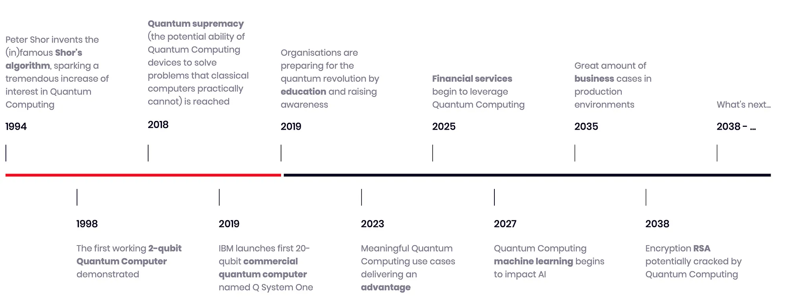

# Getting started

What is quantum computing? Well, nothing but a new paradigm to perform computation. It is based on the formalism of **quantum physics** and even though it might be challenging to grasp at first, just some basic linear algebra might help you understanding the basics. I will try to show it by examples in Python so that it is less challenging and more hands-on.

Classical computing also embraces physics but at a much higher abstraction level. By being able to manipulate electricity the first devices, analog devices, were able to perform first algorithms. Programming analog devices it is definitely a challenging task, so operation digitization was able to ease that task also making easier for machines to interoperate given that even though different manufacturers where involved, by adopting the same standards in terms of digital operations (time-bounded actions) it made it a lot easier to understand each other.

[Boolean algebra](https://en.wikipedia.org/wiki/Boolean_algebra) made this possible, providing an universal set of operations to produce the algorithms we do use on a daily basis. Being able to manufacture bits as voltages made possible to build machines capable of following that algebra and abstracting it further to higher level programming languages. The rest is history.

The main idea behind quantum computing is that, instead of working at a macroscopic level as we are used to, by using quantum states on some physical mean we could benefit from the effects inherent to quantum physics to perform computation in _different ways_. By leveraging the those effects some really complex calculations could be performed more efficiently. Don't worry, we will be using higher level programming languages as well but we need to understand what is going on under the hood.

_Superposition_, _interference_ and _entanglement_ are the key to most of the speedups claimed in the literature, and we will try to understand how we can work with those in order to produce algorithms for optimization or machine learning tasks.

Here goes a little roadmap on what has happened in the field in the last two decades:
<figure markdown>
  
</figure>

There are plenty of good references on the basic stuff so we will try to link those as well as we cover some specifics around _optimization_ and _machine learning_ more in detail. But let's start with the basics: quantum states and qubits.