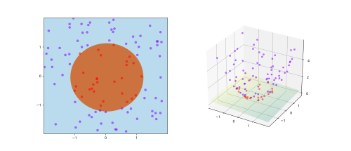

# Data embedding {.unnumbered}

A key aspect in both classical and quantum machine learning is that these are purely evidence based approaches. We need to have data in order to reverse engineer the dynamics of a given system or relationship between collected evidences and target values of the task.

Most companies harvest a huge amount of data but this data is classical for now. Our quantum devices can only work with quantum states as we saw [previously](../gettingstarted/basics.qmd). We also know that when measuring any outcome of a quantum device, a mapping is done from quantum to classical regime where plenty of information is lost

$$
|0\rangle \rightarrow 0 \quad \& \quad |1\rangle \rightarrow 1,
$$

For the machine to be aware of our classical data we should find the opposite action, we would need to introduce our data into the quantum device creating a state that is meaningful for our task. Most likely it will also require a more complex representation than simple bits, as we will be using different data representations in our classical datasets (boolean, categorical and continuous variables among others).

A special type of circuits exists meant for this particular step. This action is performed by **feature maps**, and the name comes from the mapping action between the original data space $\in \mathbb{R}^n$ to a new feature space of different dimension and complexity ($\in \mathbb{C}^m$).

Many techniques in the classical domain use this technique, mapping into a higher-dimensional space so that data becomes easy to separable. This is mostly performed by the definition of [kernels](https://en.wikipedia.org/wiki/Kernel_method) in techniques like [Support Vector Machines](https://scikit-learn.org/stable/modules/svm.html).

<figure markdown>

</figure>

And in some other cases, an intentional mapping to lower dimensional space is done to remove information redundancy and synthesize the information inside the data. Something similar to bottleneck layers on neural networks trying to define a lower dimensional latent space.

<figure markdown>

</figure>

Often, these techniques require a good understanding from the classical side in order to create the best mapping possible to the latent space. It should be able to accurately synthesize the information removing all redundant information from the original data space.

So, by definition, our mapping into the quantum regime belongs to the first family as it is in generally assumed the higher dimensional nature of quantum formalism. But each type of mapping may benefit different objectives as we previously stated.