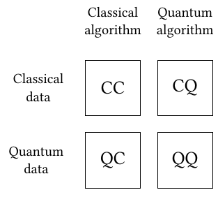

# Quantum Machine Learning {.unnumbered}

Well, there is some hype around this topic. Hopefully, how we have arrived to propose Quantum Machine Learning can be easily understood having gone trough previous sections. If we do have the ability to _train_ quantum circuits, why not use them as predictors to classification tasks or as regression model to provide us with better estimators?

If you are not entirely familiar with the concept, classical Machine Learning methods are composed of **tunable functions** and some **data characterizing a phenomena**. Canonical examples of this are, customer data and churn labels, weather conditions and likelihood of a traffic accident, etc. These are complex systems to characterize or model, it is hard to get a formulation describing the dynamics of the phenomena.

But we could learn some basic patterns linking variables to targets using an _expressive enough_ function. When we would like to predict a condition or a class for a set of evidences (data), we call those _classification_ tasks. When a percentage or a numeric value needs to be predicted, these are often called _regression_ tasks. These two belong to the category of **supervised machine learning**. When no label or target variable is defined, quite often data segmentation or clustering is performed trying to better understand the common factors between available data points, this is called **unsupervised machine learning**. There you go, one paragraph and you are already an AI expert 😊

This is the minimum basis we will need to better understand the next bit: Quantum Machine learning (QML). Mixing Quantum Computing and Machine Learning gives birth to this field, even though there is no strict meaning on how this mixture is performed. We found three common recipes, though:

* Machine Learning models for better Quantum Computing
* Quantum Computers aiding Machine Learning tasks
* Quantum Computers acting as Machine Learning models

<figure markdown>

</figure>

Putting some focus in the last two, there are classical machine steps where data needs to be filtered or selected where QC techniques may apply [@mucke2023feature]. Using Quantum Computers to find the right set of parameters on classical models [@date2021qubo]. Or adaptations of Variational Quantum Algorithms (VQA) where the functional is approximated by a Parameterized Quantum Circuit (PQC) or ansatz named after the analogous classical field of Neural Networks [@schuld2014quest]. There is plenty of hybridations we can discuss but we would like to focus on those cases where meaningful and practical approaches can be implemented... for the moment.

We will learn some basic notions on the main changes we will require to adopt these techniques, but a great chunk comes from the good practices already set by classical machine learning so we might skip the explanations already covered about those.

::: {.callout-tip collapse=true}
# Video recommendation

If interested, I find this talk on the topic by Nathan Wiebe really interesting, check it out.


:::