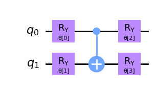

# Quantum Neural Networks {.unnumbered}

There has been some criticism about this adaptation of the classical bio-inspired model.

* Neural Networks = non-linear
* Quantum Computing = linear (up until measurement)
* Quantum Neural Networks = ?

but in fact the literature keeps growing about the potential of these techniques to provide similar results to those obtained within the state of the art but with much fewer resources [@Pe_a_Tapia_2023].

We already know classical data can be converted into quantum states. What if we take the chance to extend the existing quantum circuit so that it also performs the whole action until a class is selected as part of the measurement process?

The generic name of this type of circuit is the **Variational Quantum Classifier** and shows following structure.

<figure markdown>

</figure>

It is all based in the same concept of trainable parameterized quantum circuits and we already have the means to adapt the parameters according to a target function. We might need to device if expectation value or a given sample is the ideal measure we would like to obtain from the circuit. This is often decided depending on which type of model we would like to obtain, a classification or a regression model.

Which ansatz should we select for the trainable part of the QNN? Well, this is an open question with no direct answer. As it happens in classical NN the amount of circuits we could select for our QNN is infinite. Classical NN architectures by means of experimentation and better understanding the inner workings of our brain, have come to an agreement of what seem to be clever guesses according to specific tasks:

* For artificial vision: Convolutional Neural Networks
* For forecasting in general: Recurrent Neural Networks
* For text and context aware tasks: Transformers
* For self-driving cars: Liquid Neural Networks

So we will need to point to the literature to better understand which ansatz compositions will render best performance in our particular case. Many frameworks do provide already a set of ansatz actually implemented that reflect those existing in the literature (often also published by the same teams working at IBM or Xanadu) but they do provide interesting benchmarks that may help in our decision making process.

In essence we need to create two block, one encoding our data into quantum states (feature map) and a Parameterized Quantum Circuit (also ansatz) so that the circuit can be trained/tuned towards a specific purpose.

<figure markdown>

</figure>

```py
from qiskit import QuantumCircuit
from qiskit.circuit.library import ZZFeatureMap, RealAmplitudes

num_inputs = 2
feature_map = ZZFeatureMap(num_inputs)
ansatz = RealAmplitudes(num_inputs, reps=1)

# construct QNN
qc = QuantumCircuit(num_inputs)
qc.compose(feature_map, inplace=True)
qc.compose(ansatz, inplace=True)
qc.draw(output="mpl")
```

Real amplitudes is just an ansatz available to us following this shape below. It is versatile enough so it will help us reach the outcome we would like to obtain. But, your choice if you would like any other design for your ansatz.

<figure markdown>

</figure>

We can then connect each piece of the puzzle forming our QNN.

<figure markdown>

</figure>

```py
from qiskit.algorithms.optimizers import COBYLA
from qiskit_machine_learning.algorithms.classifiers import NeuralNetworkClassifier
from qiskit_machine_learning.neural_networks import EstimatorQNN

# We append the estructure to the Estimator primitive
estimator_qnn = EstimatorQNN(
    circuit=qc, input_params=feature_map.parameters, weight_params=ansatz.parameters
)

# construct neural network classifier
estimator_classifier = NeuralNetworkClassifier(
    estimator_qnn, optimizer=COBYLA(maxiter=60), callback=callback_graph
)
```

And compose a training procedure as it is often done, by calling _.fit_ function and evaluating the prediction.

```py
estimator_classifier.fit(features, labels)
estimator_classifier.score(features, labels)
```

Multi-label classification can also be covered but in many cases a stacked set of QNNs (one-vs-all) is preferred so that we get a set of $N$ specialized networks to balance the vote for $N$ potential classes. Instead of manually creating all those circuits and datasets we can simply invoke prepared classes in frameworks such as Qiskit that will be able to deal with those internal complexities. One should pay attention though that training various models will increase the number of iterations/executions of the circuit needed for parameter fitting (as many times as classes are).

Regression tasks can also be performed if we consider the expectation value the one mapping our target value. In that case a simple change of evaluation function would do the trick. We will see that actually it is easy as well to invoke but as we already know, getting the expectation value over simple circuit sampling may require several evaluations of the circuit in order to get all basis changes for a proper expectation value evaluation.